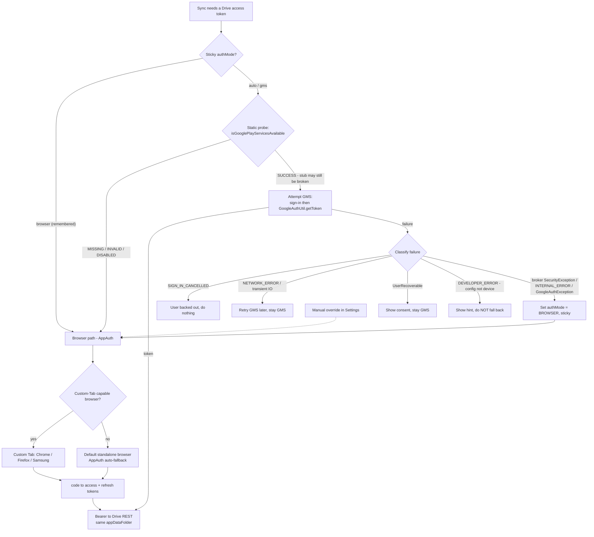
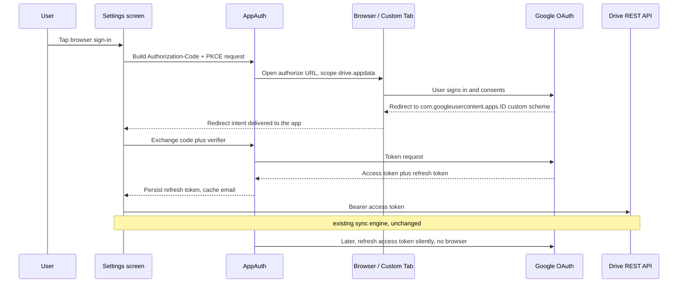

# NerLan Android — Hybrid Drive auth (GMS + browser OAuth)

**Status:** Implemented 2026-06-17. Supersedes the deferred decision in
*NerLan Android — Google Drive sync on GMS-less devices (deferred)*.

## Summary

NerLan Android syncs favorites and AI content to the user's Google Drive
`appDataFolder`. The sync engine talks to the Drive REST API directly over OkHttp;
the only thing it needs is an access token. Originally that token came solely from
Google Play Services (`GoogleSignIn` + `GoogleAuthUtil`), which is fine on healthy
devices but impossible on a de-Googled phone (the Hisense A7) whose GMS stub is
broken.

This change makes token acquisition **hybrid**: GMS where it works, a browser
OAuth flow where it doesn't — converging on the same access token, the same Drive
`appDataFolder`, and the same unchanged sync engine. The earlier objection
(switching token mechanisms would force a one-time re-login on every device) is
dissolved, because GMS devices never leave the GMS path.

## Approach

### One seam, two providers

A `TokenProvider` interface splits *"get a `drive.appdata` token"* from *"how we
got it."* Two implementations sit behind it:

- **GMS** — the existing `GoogleSignIn` session + `GoogleAuthUtil.getToken`,
  byte-for-byte unchanged.
- **Browser** — Authorization-Code + PKCE via AppAuth, storing a refresh token and
  renewing the access token silently.

A coordinator picks between them and hands the resulting Bearer token to the sync
engine, which is entirely token-source-agnostic.

### Selection is failure-driven, not availability-driven

The key design constraint: a partial GMS stub **passes the static availability
probe yet dies at the auth broker**. So `isGooglePlayServicesAvailable() == SUCCESS`
cannot be trusted to mean "GMS works." Instead we *attempt* GMS, classify the
failure, and fall back to the browser only on a structural broker failure —
remembering that verdict (`authMode` sticky in prefs) so we stop probing a dead
broker. A successful GMS sign-in clears the sticky fallback; a manual
"改用瀏覽器登入" button is the guaranteed escape when classification can't tell a
dead broker from a flaky network.

The ambiguous case is an `IOException` from `GoogleAuthUtil.getToken`, which is
thrown for **both** a flaky network and a dead broker. We retry a few times (could
be network), then treat persistent failures as broker-dead so a genuinely dead
broker eventually falls back instead of failing forever.

### The browser flow (custom-scheme, no Chrome required)

AppAuth opens Google's consent page in a Custom Tab when a capable browser exists
and **falls back to the default standalone browser otherwise** — so it works on a
de-Googled device that has only a non-Chrome browser. The redirect comes back via a
custom URI scheme that Android routes to the app; the code is exchanged for tokens,
the refresh token is persisted, and all later syncs renew silently with no browser
and no GMS.

### What was done on the Google Cloud Console

All of this happens in the **same GCP project** as the existing Android OAuth
client — that shared project is what keeps both auth paths writing to the same
Drive `appDataFolder`, so a user signed in via GMS on one device and via browser on
another sees identical synced data.

1. **Reuse the existing Android OAuth client — no new client needed.** The first
   instinct was to create an iOS-type client (the only one that historically minted
   a reverse-DNS custom scheme). That turned out to be unnecessary: Google now
   exposes the custom scheme on Android clients directly.
2. **Enable the custom URI scheme on the Android client.** Credentials → open the
   Android OAuth client → *Advanced Settings* → turn on **"Enable Custom URI
   scheme"** → Save. Without this, Google rejects the authorization request with
   `Error 400: invalid_request — "Custom URI scheme is not enabled for your Android
   client."` Enabling it authorizes the reverse-DNS redirect
   `com.googleusercontent.apps.<client-id-prefix>`.
3. **Drive API** was already enabled (the GMS path used it), so no change.
4. **Publish the OAuth consent screen.** Google Auth Platform → *Audience* →
   **Publish app** (move from "Testing" to "In production"). In "Testing" mode
   Google **expires browser refresh tokens after 7 days**, which would force the
   GMS-less device to re-login weekly. Because `drive.appdata` is a non-sensitive
   scope, publishing is instant — no verification review.

App-side wiring is just three values fed to the build: the OAuth client ID, the
reverse-DNS redirect (`com.googleusercontent.apps.<id>:/oauth2redirect`), and the
matching manifest redirect scheme. The app already ships the intent filter for that
scheme, so once the console toggle is on, the existing build works unchanged.

### Recovering an expired browser session

If a stored refresh token is later revoked or expires (the "Testing"-mode case
above), the silent renewal returns a token-endpoint error. That is permanent, so
the browser session is cleared and the UI flips back to the login button with a
"請重新登入" prompt — the browser analog of GMS's `UserRecoverableAuthException`. A
network blip during renewal is a different error class and is left intact to retry,
so a flaky connection never logs the user out.

## Trade-offs

- **Custom URI scheme on an Android client is less tamper-resistant** than the
  SHA-1-bound GMS flow (another app could claim the scheme). Acceptable for a
  single-user fallback whose entire premise is "this device has no working GMS."
- **`play-services-auth` stays a dependency.** A pure-browser rewrite could have
  dropped it; the hybrid keeps it because GMS remains the preferred path on healthy
  devices. Two auth paths is the cost of zero cross-device re-login.
- **Failure classification is heuristic.** The broker-vs-network `IOException`
  ambiguity can't be resolved from a single failure, so the design leans on a retry
  threshold plus an always-available manual override rather than perfect detection.
- **Browser refresh-token durability depends on the consent screen being
  published.** This is an operational dependency outside the app, surfaced to the
  user via the re-login prompt if it lapses.
