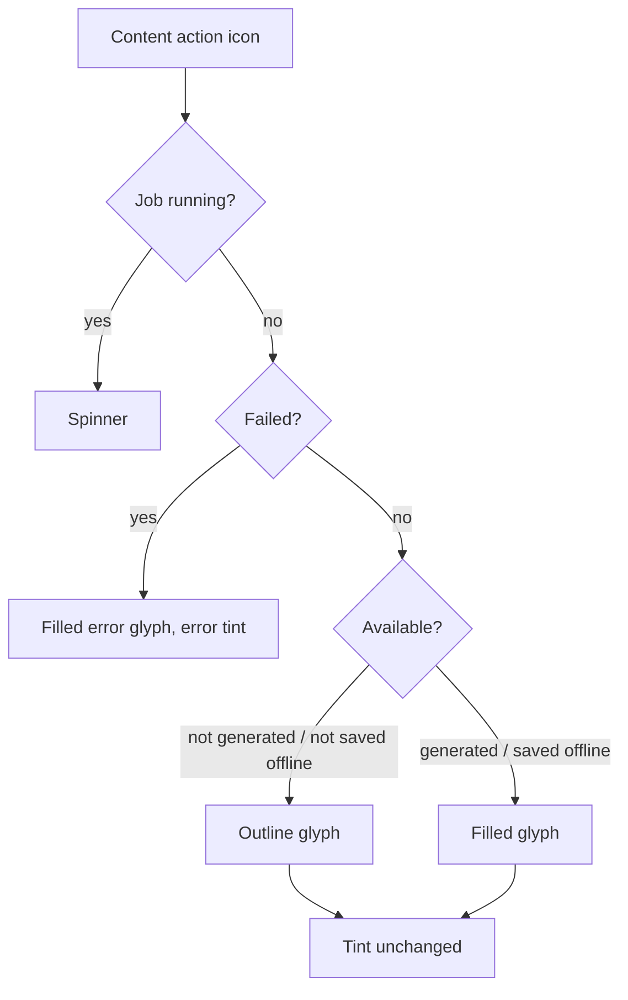

# NerLan Android — outline vs filled icons to signal content state

## Summary

The three content-action icons — transcript (逐字稿), AI handout (AI 講義), and
PDF handout (講義) — now signal their availability by icon **fill** rather than
tint: an **outline** glyph means "not yet available", a **filled** glyph means
"available". This was driven by e-ink: NerLan runs on a grayscale e-ink tablet
(GoColor7) where the previous primary-vs-onSurfaceVariant tint distinction is
nearly invisible. Fill is a shape difference that survives grayscale.

"Available" means:

- Transcript → an AI transcript has been generated (`hasTranscript`).
- AI handout → an AI handout has been generated (`hasHandout`).
- PDF handout → the course PDF is saved offline (`localAttachmentPath` present).

## Approach

- **AI icons** (`AiActions.kt`, `AiIcon`): the idle glyph now switches between
  `Icons.Outlined.*` and `Icons.Filled.*` of the *same* glyph keyed on `ready`.
  Transcript uses Subtitles; the AI handout uses AutoAwesome. Previously the AI
  handout swapped between two *different* glyphs (`AutoAwesome` when not ready,
  `Description` when ready) — that conveyed state but not as a consistent fill
  cue, and the sparkle/document change read as two unrelated icons. One glyph
  with a fill change is clearer. The running (spinner) and failed (ErrorOutline)
  branches are unchanged.
- **PDF handout** (`PlayerSheet.kt` full player; a new `RowHandoutButton` in
  `FavoritesScreen.kt` for list rows): `Icons.Outlined.Info` until the PDF is
  saved offline, `Icons.Filled.Info` once `pdfAttachments.all { localAttachmentPath != null }`.
  Attachments ride along when the episode is downloaded, so this tracks the
  episode-downloaded state in practice. `RowHandoutButton` collects download
  state only for rows that actually show the icon, mirroring the existing
  `RowFavoriteButton` / `RowDownloadButton` pattern in that file.
- Outlined variants are pulled in with import aliases
  (`outlined.Subtitles as SubtitlesOutline`, etc.) because Kotlin can't import a
  filled and outlined icon of the same simple name into one file; the call site
  reads `Icons.Outlined.SubtitlesOutline`.
- Existing tints are deliberately kept (primary when ready, onSurfaceVariant
  otherwise), so colour screens still get the old colour cue *and* the new fill
  cue; only e-ink relies on fill alone.

## Trade-offs

- The PDF-handout "filled" state means *saved offline*, not merely *exists*.
  Chosen (with the user) over "always filled" so the icon carries information
  rather than being a constant. The handout is still openable when outline — it
  fetches on demand — so outline does not mean "unavailable to view", only "not
  on device yet". A subtle distinction, accepted for the offline-clarity win.
- `RowHandoutButton` adds a download-state subscription per attachment-bearing
  row; negligible, and avoided entirely for rows with no attachment.
- The import-alias call sites (`Icons.Outlined.SubtitlesOutline`) read slightly
  oddly, but it's the standard way to use both fills of one Material glyph.

## Key Files

- `app/src/main/java/com/example/nerlan/ui/AiActions.kt` — `AiIcon` outline/filled
  by `ready`; dropped the AutoAwesome→Description glyph swap.
- `app/src/main/java/com/example/nerlan/ui/PlayerSheet.kt` — full-player 講義 icon
  outline/filled by offline state.
- `app/src/main/java/com/example/nerlan/ui/FavoritesScreen.kt` — new
  `RowHandoutButton` for list-row 講義 icons.
