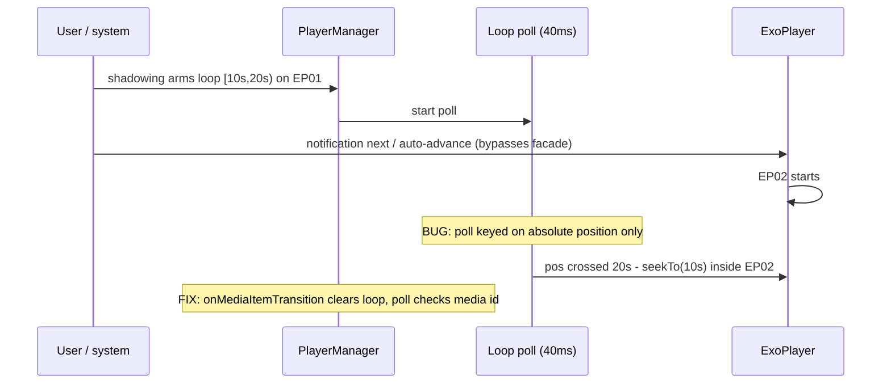

2026-07-07

# NerLan: a shadowing loop survived into the next episode and looped it forever

## What was broken

Shadowing practice loops one sentence via `PlayerManager.loopSegment(startMs, endMs)`,
implemented as a 40 ms position poll that seeks back to `startMs` whenever the
position crosses `endMs`. The loop was cleared by `play()`, `next()` and
`previous()` — but not when the playing item changed through any path that
bypasses those: auto-advance at episode end, the media-notification next button,
a headset button. The poll keys on absolute position only, so after such a
transition the still-armed loop treats the *new* episode's timeline as if it were
the old one.

Reproduced on the emulator: armed an infinite loop on an EP01 sentence
([10 s, 20 s)), sent `KEYCODE_MEDIA_NEXT`; EP02 started, played to 18.6 s, then
snapped back to 10 s — and would loop 10–20 s of the wrong episode forever.

## Fix

Two layers, because transitions and the poll are asynchronous to each other:

- `onMediaItemTransition` now calls `clearLoop()` for every transition except
  `REASON_REPEAT` (repeat-one restarts the same item, so its loop region is
  still valid).
- `loopSegment` captures the media id it was armed on; the poll stops itself if
  the playing item's id no longer matches, so even a transition the listener
  hasn't processed yet can't cause a seek into the wrong episode.

## Verification

Same steps on the fixed build: loop armed and bouncing within EP01, media-key
next to EP02 — position climbed monotonically 0 → 24.6 s straight past both old
loop boundaries, no snap-back.

(Verification note: the shadowing UI requires a transcript; one was fabricated
on the emulator by writing `files/ai/transcripts/{id}.txt` and a matching
`files/ai/cues/{id}.json` via `adb run-as`, giving six 10-second sentence cues.)

Commit: `e7a00ef` in nerlan-android.
