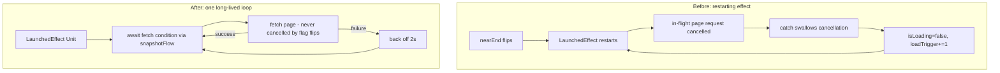

2026-07-07

# NerLan: program-detail infinite scroll no longer cancels its own page fetches

## What was broken

The next-page fetch lived in `LaunchedEffect(loadTrigger, nearEnd, initialized)`.
Restart keys mean *cancel and re-run*, so:

- Any `nearEnd` flip mid-fetch cancelled the in-flight network call.
- `catch (_: Exception)` swallowed the `CancellationException`, and the cancelled
  coroutine still executed the trailer (`isLoading = false; loadTrigger += 1`),
  which immediately re-triggered the effect.
- Adding the spinner row increments `totalItemsCount`, which by itself can flip
  `nearEnd` (`last >= totalItemsCount - 3`) — so a user resting exactly at the
  threshold could produce a cancel/re-request loop for the same page.
- On a real network failure the trailer re-ran the effect with conditions still
  true: a tight retry spin against the API.

## Fix

A single `LaunchedEffect(Unit)` owns the whole paging loop. It waits for the
cache restore, then repeats: `snapshotFlow { page == 0 || (nearEnd && page <
totalPages) }.first { it }` → fetch → append. Flag flips no longer cancel
anything (the effect has no restart keys); `CancellationException` is rethrown
(only real disposal cancels the loop); failures back off 2 s instead of
spinning. The `loadTrigger` state var is gone.

## Verification

On the emulator, opened the 72-episode program 生趣个老古人言 with no cache and
scrolled continuously to the end: every page loaded in turn through EP72 with no
stall, no stuck spinner, and no duplicate rows (the LazyColumn keys would have
crashed on duplicates).

Commit: `063044a` in nerlan-android.
