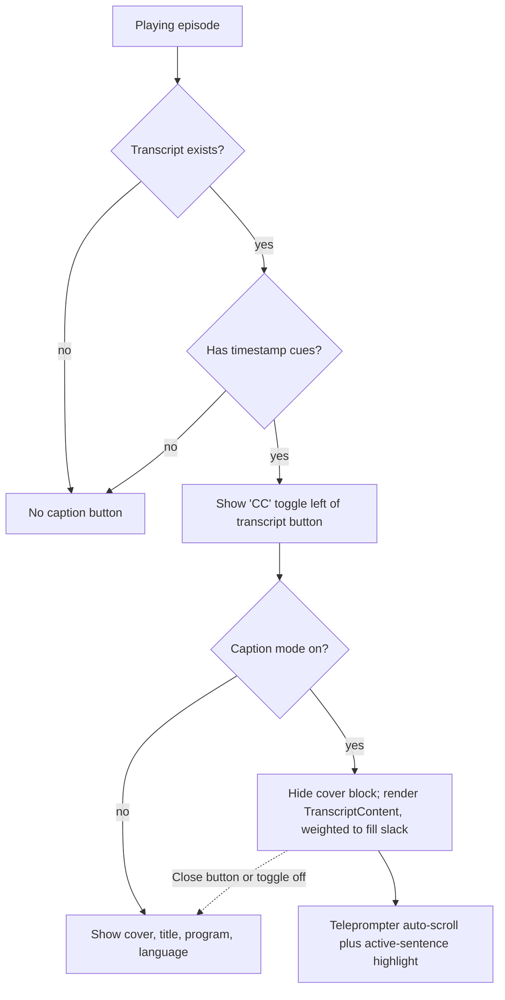

# NerLan Android — Caption mode in the player

## Summary

The full player sheet now has a caption (字幕) toggle that overlays the synced
transcript on top of the cover-art area while audio plays. When the currently
playing episode has a transcript **with timestamp cues**, a 字幕 button appears to
the left of the existing 逐字稿 (transcript) button. Tapping it hides the cover
image, episode title, program name, and language label, and renders the
transcript in that freed space — auto-scrolling so the spoken sentence stays
centered and highlighted, like live captions. Tapping 字幕 again (or the
transcript's Close button) restores the cover.

## Approach

The transcript view already existed as a reusable composable, `TranscriptContent`,
used by both the phone dialog and the large-screen study panel. It already does
the teleprompter-style continuous auto-scroll and active-sentence highlighting
when timestamp cues are present and the episode is playing. So caption mode is
almost entirely a matter of *where* that composable is mounted — embedding it
inline in the player sheet rather than opening a separate full-screen surface.

Gating: the button only shows when `ai.hasTranscript(id)` is true **and**
`ai.transcriptCues(id)` is non-empty. Cues only exist for transcripts produced by
a timestamp-capable model; an older cue-less transcript intentionally shows no
caption button (there would be nothing to sync/highlight). The cue lookup is
re-read on the store's `revision` flow, and caption mode is `remember`ed per
episode id so each track opens on its cover.

Layout: in caption mode the transcript is wrapped in a `Box` with `weight(1f)` so
it fills the vertical slack above the transport controls, which stay anchored at
the bottom. For the weight to resolve, the sheet's root `Column` switches to
`fillMaxHeight()` only while captions are showing; otherwise it keeps its original
wrap-content sizing so the non-caption layout is unchanged.

## Trade-offs

- **Reuse over a bespoke caption strip.** Embedding the full `TranscriptContent`
  (with its font-size / translate / copy header) gives a richer reading surface
  and zero duplicated scroll logic, at the cost of a slightly heavier widget than
  a minimal one-line caption bar. The auto-scroll + highlight behavior is exactly
  what a caption view wants, so the reuse pays off.
- **Per-episode reset.** Caption mode resets when the track changes, so each
  episode opens on its cover rather than silently hiding it. A track without cues
  automatically drops back to the cover and hides the button. This is more
  predictable than persisting the mode across tracks, at the cost of re-toggling
  on each new episode.
- **Button lives in the API-key-gated AI-tools row.** The toggle sits next to the
  transcript button, which only renders once an OpenAI key is set. In practice a
  transcript (and thus cues) can only exist after transcription, which requires
  that key, so the gating is consistent — but a transcript synced from another
  device with no local key would not expose the toggle.

## Key Files

- `app/src/main/java/com/example/nerlan/ui/PlayerSheet.kt` — the only file
  changed. Adds cue detection (`captionCues` / `captionsAvailable`), the
  `captionMode` state, the conditional cover-vs-transcript block (weighted,
  `fillMaxHeight` when active), and the 字幕 toggle button in the AI-tools row.
- `app/src/main/java/com/example/nerlan/ui/TranscriptDialog.kt` — unchanged;
  provides the reused `TranscriptContent` body (numbered sentences, teleprompter
  auto-scroll, active-sentence highlight, font-size / translate / copy controls).
- `app/src/main/java/com/example/nerlan/data/AIContentStore.kt` — unchanged;
  source of `hasTranscript`, `transcriptCues`, `transcriptText`, and the
  `revision` flow that triggers re-reads.
