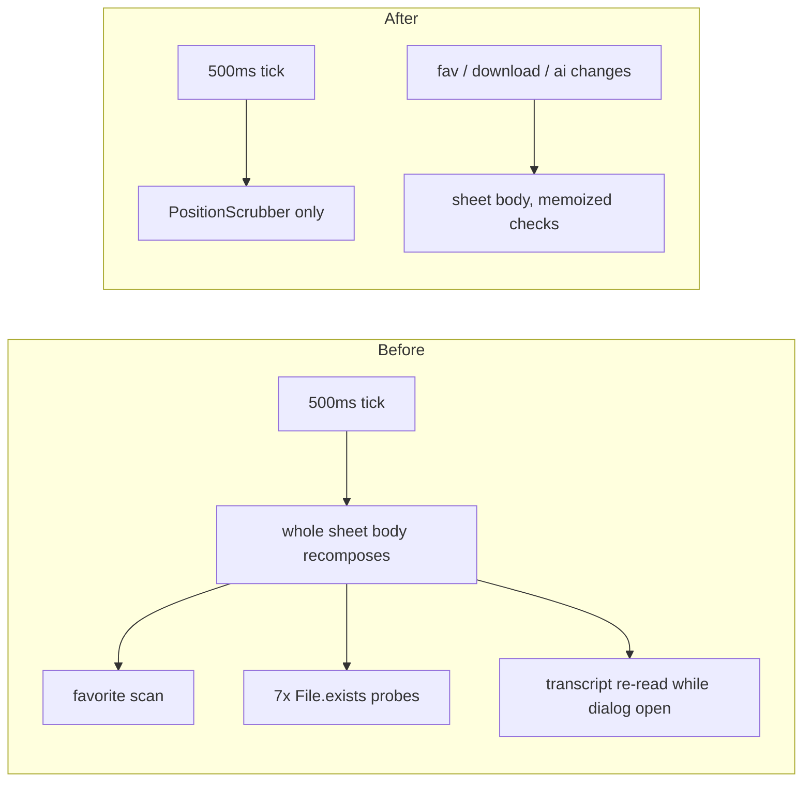

2026-07-08

# NerLan: the player sheet recomposed in full twice a second

## What was wasted

`PlayerManager.positionMs` ticks every 500 ms during playback. The sheet
collected it at the top and read it in the `ModalBottomSheet` content lambda —
the nearest recomposition scope, since `Column`/`Row` are inline — so the whole
sheet body re-executed on every tick for as long as the sheet was open:

- the transport, repeat/speed/favorite/download rows,
- `favEpisodes.any { … }` (an O(n) scan),
- the downloaded check, whose fallback probes up to seven `File.exists()` paths
  on the main thread — filesystem syscalls twice per second,
- and, while the 跟讀 dialog was open, `ai.transcriptText(id)` — an unmemoized
  full transcript file read per recomposition (the caption path at the top of
  the sheet already memoized the same read; the dialog path didn't).

This matters most on the e-ink devices the app targets.

## Fix

- The scrubber and time labels moved into a private `PositionScrubber`
  composable that collects `positionMs`/`durationMs` itself — the tick now
  recomposes only that scope.
- The favorite and downloaded checks are `remember`-ed against their actual
  inputs (`favEpisodes`/`downloadRecords` + episode id).
- The shadow dialog's transcript read is memoized on `(record.id, aiRevision)`,
  matching the caption path.

## Verification

On the emulator: time labels tick (0:02 → 0:04), tap-to-seek jumps to the tapped
fraction (2:30 at mid-track of a 4:59 episode), play/pause toggles the session
state. The narrowing of the recomposition scope is by construction — position
state is now only read inside `PositionScrubber`.

Commit: `f878798` in nerlan-android.
