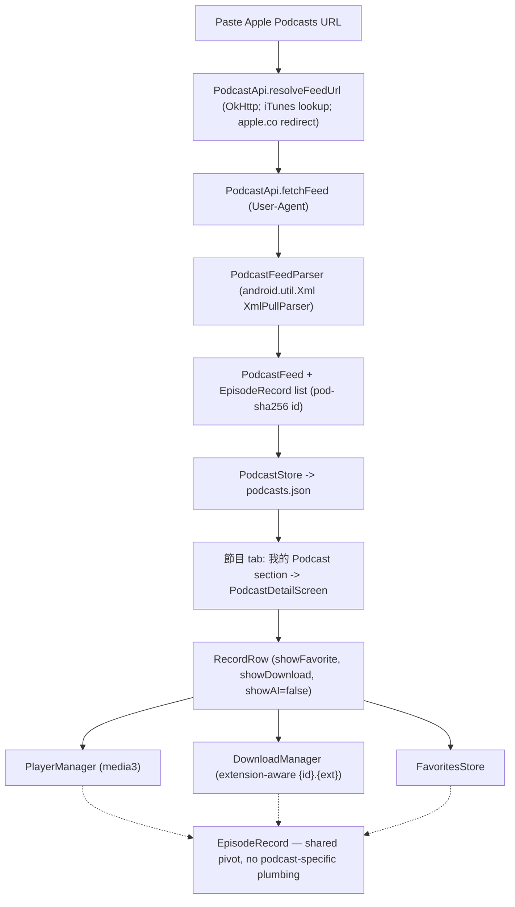

2026-06-16

# NerLan Android — podcast support + chunked AI handouts (port of the iOS features)

## Summary

The Android app (`plateaukao/nerlan-android`) gains the same two features just
shipped on iOS:

1. **Podcasts** — paste an **Apple Podcasts** share link (or a raw RSS / `apple.co`
   short link), subscribe, and the show behaves like any NER program: streaming,
   offline download, favoriting, lock-screen controls, listening stats, and the
   OpenAI transcript/handout. As on iOS, this rides on the `EpisodeRecord` pivot
   type, so nothing downstream needed podcast-specific code.
2. **Chunked AI handout** — episodes longer than about 15 min are split into
   **Part I/II/III** sections, each with four parts: **內容說明** (new), **文法重點**,
   **例句**, **單字**.

## Approach

The iOS design ports almost 1:1 because the Android app shares the architecture
(manual store singletons in `NerLanApp`, `kotlinx.serialization` JSON files,
OkHttp, media3). The substitutions are the platform-idiomatic ones:

- **RSS parsing** uses the **built-in `android.util.Xml` `XmlPullParser`** (SAX,
  namespaces off so `itunes:duration`/`itunes:image` arrive verbatim) — no
  third-party XML dependency, mirroring iOS's `XMLParser`.
- **Apple URL → feed** in `PodcastApi`: regex `/id(\d+)` → iTunes Lookup API for
  `feedUrl`; `apple.co` short links resolve via OkHttp's followed redirect
  (`response.request.url`). Feed fetches send a browser-ish `User-Agent`.
- **Stable episode id** `"pod-" + sha256(guid ?: enclosureUrl)` via
  `java.security.MessageDigest` (iOS uses CryptoKit) — filename-safe, dedups.
- **Extension-aware downloads**: `DownloadManager` probes `{id}.{ext}` (mp3 first)
  instead of hardcoding `.mp3`. Unlike iOS, **no streamed-cache change was
  needed** — media3's `CacheDataSource` keys the cache by URL, not by a filename,
  so AAC podcasts cache and replay correctly as-is.
- **Handout chunking** lives in `AIContentStore.runHandout` + a companion
  `handoutSegments`/`partTitle` (`ceil(duration / 900)` parts, transcript split at
  line boundaries balanced by character count), with `OpenAIService.generateHandout`
  taking an optional `partTitle` and emitting `h2`/`h3` accordingly. The existing
  `HandoutDialog` WebView CSS already styles both `h2` and `h3`, so multi-part
  handouts render with no CSS change.
- **UI**: `RecordRow` (the shared row in `FavoritesScreen.kt`) gains opt-in
  `showFavorite`/`showDownload`/`subtitleOverride`/`showAI` params; the new
  favorite/download affordances live in small sub-composables that collect their
  flows only when shown, so the Downloads/Favorites/AI tabs get no extra
  recompositions. Navigation follows the app's manual pattern: a nullable
  `podcastDetail` state in `MainScreen` overlays `PodcastDetailScreen` on the 節目
  tab.

A cross-platform reference for future ports now lives in the iOS repo at
`docs/android.md` (the iOS↔Android file/type map and conventions).

## Trade-offs

- **Same as iOS**: text-proportional handout split (not exact audio timestamps);
  a 16-min episode yields a tiny Part II; the handout prompt is language-learning
  flavored, so general podcasts get a less-tailored handout (transcription is
  fine); subscription list isn't cloud-synced in v1 (episode favorites/AI already
  sync via Drive).
- **Build verified, device install deferred.** `./gradlew :app:assembleDebug`
  succeeds (only pre-existing deprecation warnings). The phone runs a
  **signed-release** build and the deploy notes forbid uninstalling without
  permission, so a debug-signed APK isn't pushed over it — rollout goes through
  the normal signed-release / CI (nightly.link) path.

## Key Files

`~/src/nerlan-android/app/src/main/java/com/example/nerlan/`

New:
- `data/PodcastApi.kt` — Apple-URL → RSS resolver (iTunes Lookup) + feed fetch.
- `data/PodcastFeedParser.kt` — `XmlPullParser` RSS → `PodcastFeed` + records.
- `data/PodcastStore.kt` — subscriptions singleton, `podcasts.json`.
- `ui/PodcastDetailScreen.kt`, `ui/AddPodcastDialog.kt`.

Modified:
- `data/Models.kt` — `PodcastFeed`; `EpisodeRecord` optional `durationSeconds` /
  `audioExt` + `durationText` / `releaseDateText` helpers.
- `data/DownloadManager.kt` — extension-aware file naming + probing.
- `data/OpenAIService.kt` — `generateHandout(partTitle=)` + the four sections.
- `data/AIContentStore.kt` — `runHandout` chunking + `handoutSegments`/`partTitle`.
- `ui/FavoritesScreen.kt` — `RecordRow` opt-in affordances + sub-composables.
- `ui/ProgramListScreen.kt` — "+" entry, 我的 Podcast section, `PodcastRow`.
- `ui/MainScreen.kt` — podcast detail navigation.
- `NerLanApp.kt` — `PodcastStore` singleton.
