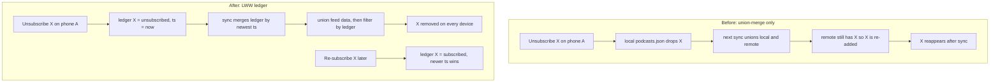

# NerLan Android — Podcast unsubscribe not sticking across Drive sync

## Problem

After unsubscribing from a podcast on the Android app, the show kept reappearing
once Google Drive sync ran — on the same device, and it never went away on the
user's other phone either. Unsubscribe was effectively impossible to make stick
while Drive sync was on.

## Root Cause

`DriveSync` synced `podcasts.json` with a **union-merge** by feed id (the model
chosen for favorites and the AI index): the merged set is `remote ∪ local`, so
additions on any device propagate but **deletions cannot be expressed**. When a
show was unsubscribed it was removed from the local `podcasts.json`, but the next
sync read the still-present copy back from Drive and re-added it. A union of two
sets can never represent "this element was removed."

The iOS app doesn't hit this because it syncs each subscription as its own iCloud
key-value entry, where removing the key *is* a real, propagating delete. Android
syncs whole-file blobs through Drive's appDataFolder, which has no per-key delete.

## Solution

Add a **last-writer-wins subscription ledger** — `podcast-subs.json`, a map of
`feed id -> { subscribed: Bool, ts: Long }` — merged by newest timestamp:

- `PodcastStore.unsubscribe` writes `{ subscribed = false, ts = now }`;
  `subscribe`/`add`/`refresh` (via `upsert`) write `{ subscribed = true, ts = now }`.
  Both files (`podcasts.json` + `podcast-subs.json`) are persisted together.
- `DriveSync.syncPodcasts` LWW-merges the ledger (max `ts` per id wins), still
  union-merges the feed **data**, then keeps only feeds the merged ledger marks
  subscribed, and uploads both files. `PodcastStore.reload()` re-reads both after a
  sync.
- A missing ledger entry **defaults to subscribed**, so shows added before the
  ledger existed keep working with no migration.

This gives deletes a propagating, mergeable representation: an unsubscribe is a
timestamped tombstone that filters the show out everywhere, and a later
re-subscribe wins with a newer timestamp (a plain tombstone set would block
re-subscription forever).

## Key Files

- `app/src/main/java/com/example/nerlan/data/Models.kt` — `SubEntry(subscribed, ts)`.
- `app/src/main/java/com/example/nerlan/data/PodcastStore.kt` — the in-memory
  ledger, timestamped writes in `subscribe`/`unsubscribe`/`upsert`, persist both
  files, reload both.
- `app/src/main/java/com/example/nerlan/data/DriveSync.kt` — `syncPodcasts`
  (replaces the `podcasts.json` union-merge), `mergeLedger`, ledger read helpers,
  `subsFile`.

## Lessons Learned

- A union-merge (G-Set CRDT) only supports adds; any user-deletable synced
  collection needs delete-aware semantics — here an LWW-Register per element.
- Per-key stores (iOS KVS) get deletes for free; whole-blob stores (Drive files)
  must model deletion explicitly. Don't assume a sync model ports across
  platforms unchanged just because the feature does.
- A bare tombstone set makes deletes stick but permanently blocks re-adding the
  same item; pairing the tombstone with a timestamp (LWW) restores re-subscribe.
