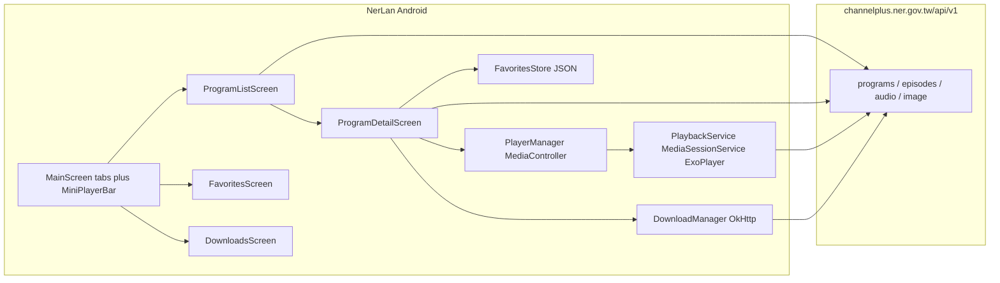

# NerLan Android — feature-parity port of the iOS language-learning app

## Summary

Created `~/src/nerlan-android`, a Kotlin/Jetpack Compose Android app with the same features as the iOS NerLan app: browse NER Channel+ language programs (96 programs, 19 languages) with wrapped language-filter chips, full episode archives with infinite scroll, background playback with media notification and lock-screen controls, 0.5×–2× speed control, MP3 downloads grouped by program/language, and favorites for both episodes and programs. Verified end-to-end on a Pixel 7 API 34 emulator against the live API.

## Approach

**Same API, same shapes.** The data layer is a direct translation of the iOS client: `ChannelPlusApi` (OkHttp + kotlinx-serialization) hits the same four endpoints (`/programs?programType=2`, `/programs/episodes/{id}`, `/audio?key=`, `/image?key=`), and `EpisodeRecord` keeps the identical JSON shape so both apps snapshot episodes the same way for favorites/downloads.

**Playback architecture differs by platform idiom.** Where iOS uses a `PlayerManager` singleton owning `AVPlayer` plus manual `MPNowPlayingInfoCenter` wiring, Android gets the equivalent from Media3: `PlaybackService` (a `MediaSessionService` hosting ExoPlayer) provides the media notification, lock-screen controls, audio focus, and background lifetime for free; a `PlayerManager` object connects via `MediaController` and re-exposes player state as `StateFlow`s for Compose. The queue is the episode list the user tapped in — `setMediaItems` with the start index — and each `MediaItem` carries its serialized `EpisodeRecord` in metadata extras so the UI can reconstruct program context (favorites from the player sheet) without a lookup table.

**Project scaffolding** came from the `android` CLI's `empty-activity` template (AGP 9, Kotlin 2.3, Compose BOM 2026.03). The template's Navigation 3 setup was dropped in favor of plain tab state with a single-level pushed detail per tab — matching what the iOS app actually does in practice and avoiding serializing `Program` through nav keys.

**UI mapping** (iOS → Android): SwiftUI custom `FlowLayout` → built-in `FlowRow`; `safeAreaInset`/overlay mini player → `Scaffold.bottomBar` as a `Column` of mini bar + `NavigationBar` (no hit-testing trickery needed — Compose's bottomBar is naturally interactive and insets content); full-player `sheet` → `ModalBottomSheet`; month-free infinite scroll uses a `derivedStateOf` near-end trigger on `LazyListState`.

**Downloads** are a streaming OkHttp copy to `filesDir/audio/{episodeId}.mp3` with a `.part` temp file and a `StateFlow<Map<String, Float>>` for progress — the direct-MP3 simplification from the Channel+ migration carries over.

## Trade-offs

- **Package name** is `com.example.nerlan` (template default) with `applicationId com.danielkao.nerlan`; renaming the package wasn't worth the churn.
- **Single-level navigation** per tab instead of a real back stack — sufficient for list → detail, would need revisiting if deeper flows appear.
- **Position polling** (500 ms coroutine loop) instead of Media3's progress listener plumbing; simple and adequate for a scrubber.
- **Swipe-to-delete** from iOS became explicit trash-can buttons in rows — more idiomatic-Compose-effort to do swipe, and the button is more discoverable anyway.
- **No journey/UI tests**; template test files were removed rather than maintained against the placeholder screens.

## Key Files

- `app/src/main/java/com/example/nerlan/data/` — `Models.kt`, `ChannelPlusApi.kt`, `FavoritesStore.kt`, `DownloadManager.kt`
- `app/src/main/java/com/example/nerlan/player/` — `PlaybackService.kt` (MediaSessionService), `PlayerManager.kt` (MediaController + StateFlows)
- `app/src/main/java/com/example/nerlan/ui/` — `MainScreen.kt` (tabs + mini bar), `ProgramListScreen.kt` (FlowRow chips), `ProgramDetailScreen.kt` (infinite scroll), `PlayerSheet.kt` (speed menu), `DownloadsScreen.kt` (節目/語言 grouping), `FavoritesScreen.kt`
- `app/src/main/AndroidManifest.xml` — media playback service + permissions
