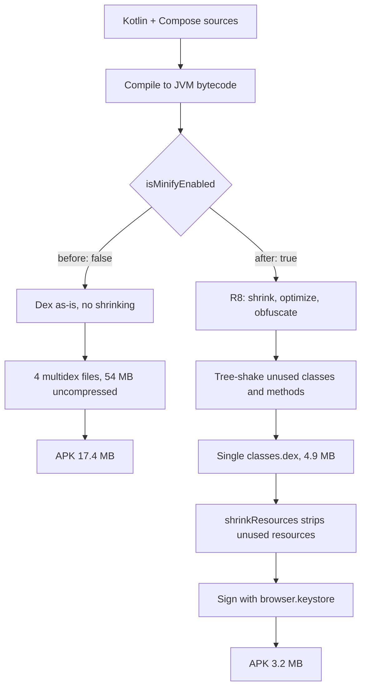

# NerLan Android — Enable R8 minification for release builds

## Summary

Release builds of nerlan-android shipped with `isMinifyEnabled = false`, so the APK contained the entire dependency graph un-tree-shaken across four multidex files — ~17.4 MB, essentially 100% bytecode. Enabling R8 code shrinking plus resource shrinking, and supplying the previously-missing `proguard-rules.pro`, cut the release APK to 3.2 MB (−82%) with no runtime regressions observed on two physical devices. Landed in commit `4fc4e93`; the `v1.2` release/tag was updated to point at it.

## Approach

The APK was code-dominated: native libs totalled 0.04 MB and resources 1.3 MB, while the four DEX files were ~54 MB uncompressed. With minification off, nothing eliminated dead code, so transitive heavyweights (`play-services-auth` pulling in basement/base/fido/tasks, `media3-transformer`, navigation3, coil, okhttp) all shipped whole. This is the textbook case where R8 pays off, so the fix was simply to turn it on rather than to trim dependencies.

Two settings in the `release` build type: `isMinifyEnabled = true` and `isShrinkResources = true` (the latter requires the former). The `proguardFiles(...)` line already referenced `proguard-rules.pro`, but that file did not exist — harmless only because the rules were never read while minify was off; the file had to be created before flipping the switch.

The one library needing explicit keep rules under R8 full mode (AGP 9's default) is kotlinx.serialization — the app uses it for the Channel+ API models and the on-disk JSON stores (favorites.json, downloads.json, Drive sync payloads). The standard serialization keep rules (preserve `$Companion` and generated `serializer()` entry points; field names may still be obfuscated since generated serializers use the descriptor, not reflection) were added, plus `-dontwarn` for okhttp's optional platform deps. Every other dependency ships its own consumer rules, so they needed nothing.

Verification was on-device rather than via tests (there is no test target). The R8 APK was installed with `adb install -r` (same `browser.keystore` signature, so app data was preserved) onto the PEUM00 phone and the GoColor7 e-ink tablet. Because the existing JSON stores survived the reinstall, the fact that Favorites and the Programs list rendered on launch is direct evidence that serialization deserialization still works under R8 — the highest-risk failure mode. No crashes in logcat; the only flagged lines were OPPO ColorOS framework noise.

## Trade-offs

- **R8 full mode is more aggressive** than legacy ProGuard and can strip reflection-reachable code. The risk is concentrated in kotlinx.serialization (mitigated with keep rules) and verified on device. Future deps that rely on reflection may need new keep rules; the symptom would be a runtime crash in a release build that a debug build doesn't show.
- **Obfuscation makes release stack traces unreadable.** Not currently a problem (no crash-reporting backend), but a `mapping.txt` is produced per build under `app/build/outputs/mapping/release/` and would need archiving if symbolication is ever wanted.
- **Slower release builds** — R8 adds ~30–40 s. Irrelevant for the CI snapshot job and occasional releases.
- **On-device verification only.** With no test target, correctness of the minified build rests on manual click-through. Launch + persisted-data load are confirmed; playback, downloads, Drive sync, and AI/OpenAI flows are left to manual checks.

## Key Files

- `app/build.gradle.kts` — `release` build type: `isMinifyEnabled = true`, `isShrinkResources = true`.
- `app/proguard-rules.pro` — new; kotlinx.serialization keep rules for R8 full mode + okhttp `-dontwarn`s.
- `.github/workflows/build.yaml` — unchanged, but the snapshot `assembleRelease` artifact now builds at ~3.2 MB.
