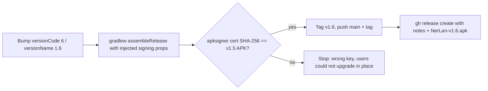

2026-07-10

# NerLan v1.6 release

Cut and published NerLan v1.6 to GitHub (https://github.com/plateaukao/nerlan-android/releases/tag/v1.6): version bump to `versionCode 6` / `versionName "1.6"`, a signed release APK attached as `NerLan-v1.6.apk`, and release notes covering the 21 commits since v1.5.

This is a stability-and-performance release — no new features. The highlights: a wake lock keeps playback alive with the screen off, the player no longer recomposes the whole sheet on every position tick, the streamed-audio cache is bounded at 2 GB LRU, Drive sync no longer cancels in-flight syncs and paginates its listing, downloads/stats records are written atomically, and several player correctness fixes (wrong-episode playback, stale sentence loops, re-entrant initialization).

## How the release is signed

The interesting part of this release was rediscovering the signing recipe, because the repo intentionally contains none of it: `app/build.gradle.kts` has no `signingConfig`, and there is no keystore or `keystore.properties` in the project. The v1.5 APK on GitHub is nevertheless release-signed with a personal certificate (CN=Daniel Kao, Taipei).

The recipe lives in `~/bin/bri` (and its siblings `bra`, `brdi`), a one-liner shared across projects: it passes Gradle's *injected signing* properties on the command line, pointing at `~/browser.keystore` with alias `browser`:

```
./gradlew clean assembleRelease \
  -Pandroid.injected.signing.store.file=/Users/maoyuankao/browser.keystore \
  -Pandroid.injected.signing.store.password=… \
  -Pandroid.injected.signing.key.alias=browser \
  -Pandroid.injected.signing.key.password=…
```

Before building, the keystore's certificate fingerprint was checked against the actual v1.5 release asset (downloaded from GitHub, `apksigner verify --print-certs`) — both report SHA-256 `85ca929b…05ba65`. This check matters: an APK signed with a different key would install fine for new users but refuse to upgrade over v1.5 on existing devices, forcing an uninstall that wipes local data.



The built APK was verified (`versionCode='6' versionName='1.6'`, signer matches v1.5) before tagging `v1.6` and publishing with `gh release create`.
