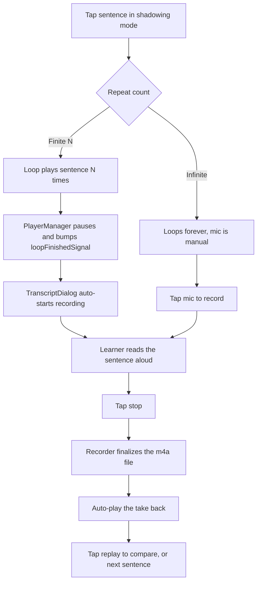

# NerLan Android — Shadowing practice mode with voice recording

## Summary

Ports the iOS shadowing feature (see `nerlan-shadowing-mode`) to the Android app.
Shadowing is a language drill: listen to one sentence, repeat it aloud, loop it a
few times. The app already produced timestamped, sentence-segmented transcripts
(Whisper cues) and a synced caption view, so the work was sentence-grained
controls on top of that, plus recording.

From the player, **跟讀** opens the transcript (a full-screen dialog on phone, the
`StudyPanel` side panel on large screens) already in shadowing mode. There the
learner loops a sentence, steps between sentences, picks a repeat count, then
records themselves and plays it back. With a finite count the cycle is hands-free:
the sentence plays N times, recording auto-starts, and the take auto-plays on stop.

## Approach

The structure mirrors iOS one-to-one (`PlayerManager`, `TranscriptDialog`,
`StudyPanel`, `SettingsStore`), with the platform differences below.

**Loop primitive via polling.** `PlayerManager.loopSegment(startMs, endMs, times)`
loops a single `[start, end)` region. Unlike iOS (`AVPlayer` boundary observer),
Media3 exposes no exact boundary callback through `MediaController`, so a tight
coroutine poll (roughly every 40 ms) watches the end and seeks back — far finer than the existing
500 ms position loop. A `triggered` latch avoids double-counting while the
async seek lands. `times == null` loops forever; a finite count pauses on the
sentence and bumps `loopFinishedSignal` (a `StateFlow<Int>`). Loops start exactly
at the cue start — no lead-in.

**Recording is a separate object.** `ShadowRecorder` wraps `MediaRecorder` and
`MediaPlayer`, one clip per (episode, sentence) in `cacheDir/shadow`. Android
needs no audio-session category dance; it just clears the loop and pauses the
original before taking the mic. `MediaRecorder.stop()` finalizes synchronously
(unlike iOS's async finish callback), so auto-play after stop runs inline.

**Hands-free + interruption.** `TranscriptDialog` collects
`loopFinishedSignal.drop(1)` (skips the value emitted on subscription, so entering
the view never triggers a recording) and auto-starts recording the current
sentence. The replay control becomes a **pause** while a segment repeats. Stepping
to another sentence — tap, previous, or next — while recording abandons the take
and plays that segment, because `loopSentence` resets the recorder first.

**Permission.** `RECORD_AUDIO` is a runtime permission, requested with an
activity-result launcher; denial shows a "go to settings" dialog. (iOS only needs
the `NSMicrophoneUsageDescription` string.)

**Entry point.** 跟讀 routes like the 逐字稿 button: a `TranscriptDialog` on phone
or a new `StudyItem.Shadow` side-panel item on large screens, with
`startShadowing = true` so the view auto-enables shadowing on first composition.

## Trade-offs

- **Polling vs callback.** A 40 ms poll is simple and works through
  `MediaController`, at the cost of a small CPU tick while looping and up to about 40 ms
  of overshoot. Exact `ExoPlayer.createMessage` boundaries would need to live in
  `PlaybackService`, not the controller — not worth the coupling.
- **Gated on transcribed episodes.** 跟讀 and the loop toggle appear only where a
  cued transcript exists — same gate as the caption toggle.
- **Finite count pauses.** A finite loop stops on the sentence (then auto-records)
  rather than continuing; ∞ is the "just loop, manual mic" escape hatch.
- **Practice clips are disposable.** Recordings live in `cacheDir` (last attempt
  per sentence, not synced).
- **e-ink.** While shadowing, the view uses the instant jump-to-center scroll, not
  the animated drift, so the looped sentence doesn't smear/ghost on e-ink.

## Key Files

- `app/.../player/PlayerManager.kt` — `loopSegment`/`clearLoop`/`pause`,
  `loopRegion` + `loopFinishedSignal`, polling loop.
- `app/.../player/ShadowRecorder.kt` (new) — per-sentence `MediaRecorder`/`MediaPlayer`,
  auto-play-after-stop.
- `app/.../ui/TranscriptDialog.kt` — shadowing toggle, cue→region math, tap-to-loop,
  transport (prev / pause-or-replay / next), repeat-count, record + play-my-voice,
  auto-record/auto-play, permission launcher.
- `app/.../ui/PlayerSheet.kt` — 跟讀 entry; `ui/StudyPanel.kt` — `StudyItem.Shadow`.
- `app/.../data/SettingsStore.kt` — `shadowLoopCount`; `AndroidManifest.xml` — `RECORD_AUDIO`.
