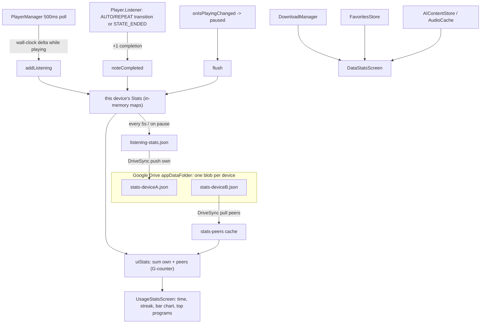

# NerLan Android — Usage & Data statistics screens

## Summary

Ports the iOS statistics feature to the Android app (`plateaukao/nerlan-android`).
Two new items at the bottom of the Settings dialog, each opening its own
full-screen dialog, kept **separate** by design:

- **使用統計 (Usage)** — listening *behavior* over time: total listening time,
  completed episodes, current streak, today/this-week/this-month subtotals, a
  日/週/月 bar chart, and the most-listened programs.
- **資料統計 (Data)** — an *inventory* of stored content: favorites, downloads
  (count/size/attachments), streamed cache, AI content, and a language breakdown
  of downloads.

As on iOS, the app had **never recorded playback**, so the Data screen is fully
retroactive while the Usage screen needed new tracking and accumulates
**forward-only** from this release.

## Approach

The Android app mirrors the iOS architecture (singleton stores via
`NerLanApp.instance`, JSON files in `filesDir`, `StateFlow` to Compose), so the
port follows the same shape, adapting three platform specifics.

**Tracking (`ListeningStatsStore` + `PlayerManager`).** A new store accumulates on
`PlayerManager`'s existing 500 ms position-poll loop: each iteration credits the
*wall-clock* delta since the last tick while `isPlaying`, dropping deltas ≥ 5 s
(pause/seek/background) as gaps — so it's real time spent, independent of playback
rate. Completions are counted through `Player.Listener`: `onMediaItemTransition`
with reason `AUTO`/`REPEAT` (an item played to its end and advanced or looped) and
`onPlaybackStateChanged == STATE_ENDED` (the queue's last item). `flush()` on
pause persists and requests a sync.

**Cross-device sync over Google Drive as a per-device G-counter.** The iOS version
uses iCloud KVS; Android already has `DriveSync` (an appDataFolder REST sync). A
single shared total can't merge — two devices listening offline would clobber each
other. So each device only ever increments its **own** partition, written to Drive
as `stats-<deviceId>.json`; on sync the device uploads its own blob and downloads
every peer blob into a local `stats-peers` cache. Display sums own + peers, which
is conflict-free since partitions never overlap. The stats step is wrapped in
`runCatching` inside `DriveSync.sync()` so a stats hiccup can't abort the existing
favorites/AI sync. No settings change was needed — stats ride the existing
event-driven, globally-gated Drive sync.

**Charts without a dependency.** The project has no charting library and follows a
minimal-dependency convention. The bar chart is drawn with Compose primitives — a
`Row` of weighted `Box`es whose `fillMaxHeight(fraction)` scales each bar to the
largest value, with a parallel axis-label row that blanks dense labels (e.g. every
6 hours / every 5 days) so they don't overflow. The 日/週/月 selector is a Material3
`SingleChoiceSegmentedButtonRow`.

**Thread safety.** Accumulation runs on the player's main-thread poll while
`DriveSync` reads/writes on `Dispatchers.IO`, so the store guards its mutable maps
with a single lock; the whole usage view is computed in one locked pass
(`uiStats()`), and disk writes happen off-lock on an IO scope from an immutable
snapshot.

**Dates.** `minSdk` is 24 with no core-library desugaring, so `java.time` is
unavailable; day bucketing, streak, and series use `Calendar`/`SimpleDateFormat`
with sortable `yyyy-MM-dd` keys.

## Trade-offs

- **Forward-only Usage data** — no historical playback to backfill; a first-run
  empty state ("開始聆聽後…") covers it.
- **Cache item count** — ExoPlayer's `SimpleCache` keys by URL, so a per-episode
  count is only available once the cache is initialised; the Data screen shows the
  count only then (`cachedResourceCount` returns -1 otherwise) and always shows the
  size. A minor divergence from iOS, which counts cache files directly.
- **Day boundaries** use the device's local time zone (fine for one user; a
  cross-time-zone device could mis-bucket a day).

## Key Files

- `app/src/main/java/com/example/nerlan/data/ListeningStatsStore.kt` — new store:
  tracking model, throttled JSON persistence, per-device G-counter Drive hooks, and
  the merged `uiStats()` view.
- `app/src/main/java/com/example/nerlan/player/PlayerManager.kt` — listening
  accumulation in the 500 ms poll; completion counting via `Player.Listener`;
  flush on pause.
- `app/src/main/java/com/example/nerlan/data/DriveSync.kt` — `syncStats()`: push
  own blob, pull peers, isolated with `runCatching`.
- `app/src/main/java/com/example/nerlan/ui/UsageStatsScreen.kt` — Usage dialog,
  Compose bar chart, shared `StatRow`, `durationText`.
- `app/src/main/java/com/example/nerlan/ui/DataStatsScreen.kt` — Data inventory dialog.
- `app/src/main/java/com/example/nerlan/ui/SettingsScreen.kt` — 統計 section with
  the two entries.
- `NerLanApp.kt`, `DownloadManager.kt`, `AIContentStore.kt`, `AudioCache.kt` —
  store registration and inventory helpers.
