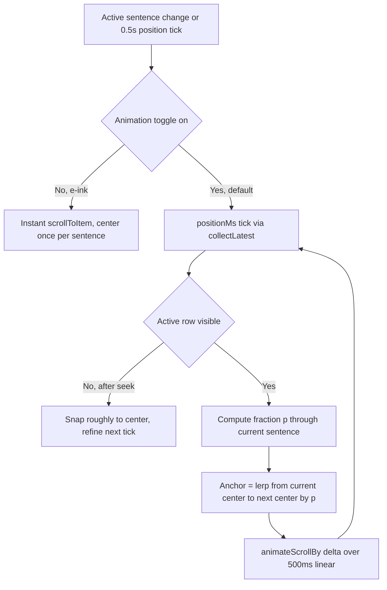

# NerLan (Android) — Centered transcript with continuous teleprompter scroll

## Summary

In the transcript viewer, the sentence currently being spoken used to be pinned to the **top** of the viewport while the iOS app keeps it **centered** (`scrollTo(anchor: .center)`). This change centers the active sentence on Android too, and goes one step further than a per-sentence snap: when animation is enabled it scrolls **continuously**, gliding the active line toward the center over the sentence's own duration so there is no jump at the sentence boundary. A new Settings toggle (置中捲動動畫, on by default) falls back to an instant per-sentence jump for e-ink devices.

## Approach

`LazyColumn`/`LazyListState` has no "center" anchor — `animateScrollToItem(index)` aligns an item's *top* to the viewport top. Centering therefore means scrolling to the item with a negative offset of half the leftover space: `-(viewportHeight - itemHeight) / 2`, read from `listState.layoutInfo`.

Two modes, chosen by the new `transcriptScrollAnimated` setting:

- **Animated (default, normal phones)** — a teleprompter-style continuous drift. The player publishes `positionMs` every 500ms; a `collectLatest` on that flow re-targets the scroll on each tick. For the current sentence `i`, it computes the fraction `p` of the way through the sentence (`(t - cue[i].start) / (cue[i+1].start - cue[i].start)`), then interpolates the scroll anchor from sentence `i`'s center toward sentence `i+1`'s center by `p`, and `animateScrollBy(delta, tween(500ms, LinearEasing))` toward it. Because each tick is animated over about 500ms and `collectLatest` cancels the in-flight animation as the next tick arrives, the motion reads as a smooth, constant drift rather than a snap. Deltas are recomputed from live `layoutInfo` each tick, so variable row heights and small estimation errors self-correct instead of accumulating.

- **Off (e-ink)** — an instant `scrollToItem` that centers each sentence once, when it becomes the active index.

The e-ink fallback exists because of a hardware/OS constraint discovered while testing on the HNR320T color e-ink device: it sets `animator_duration_scale = 0` system-wide (e-ink panels smear during animation). Compose honors that scale through `MotionDurationScale`, so `animateScrollToItem`/`animateScrollBy` collapse to instant there regardless of any in-app flag — an app toggle cannot force animation without injecting a custom `MotionDurationScale`. Rather than fight the platform, the instant per-sentence mode is the right behavior for e-ink, and the toggle makes that explicit and user-controllable.

## Trade-offs

- **Continuous drift is gated on animation being on.** On e-ink, driving a scroll every 500ms would cause constant full/partial refreshes and heavy ghosting, so continuous mode is deliberately *not* used there; e-ink gets the instant per-sentence jump instead.
- **Drift cadence is bounded by the 500ms position tick.** The motion is a chain of 500ms linear animations rather than a per-frame interpolation. This is smooth enough in practice and avoids reading `positionMs` in composition (which would recompose the row list every tick); the position flow is collected inside a `LaunchedEffect` so only the scroll coroutine runs each tick.
- **Off-screen target (after a seek) snaps once.** When the active row isn't in `visibleItemsInfo`, its height is unknown, so it snaps to a rough center for one tick and the next tick refines precisely. A brief imprecision on the rare seek case, in exchange for not threading measured heights through a slower two-pass animation.
- **The toggle is a manual choice, not auto-detected.** The app does not read `animator_duration_scale` to auto-switch; the user picks the mode. Simpler, and it lets a normal-phone user opt into instant scrolling too.

## Key Files

- `app/src/main/java/com/example/nerlan/ui/TranscriptDialog.kt` — the two-mode auto-scroll: continuous `collectLatest` drift vs. instant per-sentence centering; centering offset math from `layoutInfo`.
- `app/src/main/java/com/example/nerlan/data/SettingsStore.kt` — `transcriptScrollAnimated` flag (default `true`), persisted in SharedPreferences.
- `app/src/main/java/com/example/nerlan/ui/SettingsScreen.kt` — the 逐字稿 / 置中捲動動畫 toggle and its e-ink guidance text.
