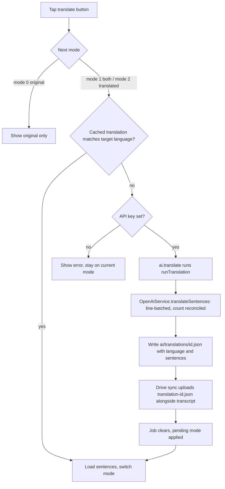

# NerLan Android — Transcript font sizing & on-demand translation

## Summary

Ports the iOS transcript font-size + translation feature (see
[iOS ADR](nerlan-transcript-font-translation.md)) to the matching Android app:

1. **No header titles** on the 逐字稿 (transcript) and AI 講義 (handout)
   full-screen dialogs — the title was redundant.
2. **Font-size button** on the transcript: loops 3 sizes (17/21/26 sp) and
   remembers the choice across transcript screens.
3. **Translate button**: loops the transcript through three modes —
   *original* → *original + translation (per sentence)* → *translation only* —
   translating into a target language chosen in Settings (default 繁體中文).
   Translations are generated on demand by the chat model, cached per episode,
   and synced to the user's Google Drive appDataFolder.

Verified on two physical phones (cross-device translation sync working).

## Approach

The Android app deliberately mirrors the iOS architecture file-for-file, so each
piece has a direct counterpart:

- **Storage / generation** (`AIContentStore`): a `translations/{id}.json`
  (`StoredTranslation{language, sentences}`) sits beside the transcript, cues, and
  handout. A dedicated `translationJobs` StateFlow drives the spinner;
  `runTranslation` reads the transcript, splits it with `displaySentences`, calls
  the new `OpenAIService.translateSentences`, writes the file, and requests a Drive
  sync. Deleting/regenerating a transcript drops its translation too.
- **Translation API** (`OpenAIService.translateSentences`): batches whole
  sentences (≤40 lines / ≤3000 chars) and reconciles each batch's returned line
  count to its input count, so the 1:1 sentence alignment that mode 1 needs can't
  drift. Reuses the existing `chat()` helper at `temperature = 0`.
- **UI** (`TranscriptDialog`): `TranscriptContent` now takes the `EpisodeRecord`
  (so it can trigger generation), drops the title, and adds the font + translate
  icon buttons. Font scale lives in `SettingsStore` (SharedPreferences StateFlow,
  the Android analog of iOS `@AppStorage`); translate-mode is local state that
  resets each open. A `LaunchedEffect` keyed on the translation job applies a
  pending mode switch when generation completes, or surfaces the error.
- **Settings** (`SettingsScreen`): a 翻譯 `ExposedDropdownMenu` of common
  languages, default 繁體中文.

**Drive sync** needed only a small extension: translations join transcripts,
handouts, and cues as a write-once content file, named `translation-{id}.json` in
the flat appDataFolder layout. Because the name is keyed only by the short episode
id, the two iOS bug fixes from the same work batch **do not apply here**: there is
no 255-byte readable-folder-name truncation (Drive has no per-component byte
limit the way an iOS filesystem path does), and cover images use Coil's own cache
rather than the iOS hand-rolled `CoverImageCache`.

## Trade-offs

- **Translation is write-once on Drive, like cues.** A target-language change
  overwrites the local file, but `syncContentFiles` only pushes files the remote
  lacks (it won't re-upload a renamed-identical file). So a language change
  doesn't propagate *through* Drive; instead each device regenerates locally on
  next view when its cached `language` ≠ the current setting. This matches the
  app's existing local-wins, write-once content model and avoids a Drive
  delete/re-upload dance.
- **Translate-mode resets per open; font size persists.** Same rationale as iOS:
  a persisted "translation only" mode would auto-trigger a paid job on every open.
- **Font scale uses fixed sp sizes** (deterministic 3-step loop) rather than the
  system font scale.

## Key Files

- `data/AIContentStore.kt` — translations dir, `translation()`, `translationJobs`,
  `translate`/`runTranslation`, delete/clearAll wiring, `translationCount()`.
- `data/OpenAIService.kt` — `translateSentences` + `lineBatches`.
- `data/DriveSync.kt` — `translation-{id}.json` added to `contentFiles` /
  `isContentName` / `writeContent`.
- `data/Models.kt` — `StoredTranslation`.
- `data/SettingsStore.kt` — `transcriptFontScale`, `translationLanguage`,
  `TRANSLATION_LANGUAGES`, `TRANSCRIPT_FONT_SIZES`.
- `ui/TranscriptDialog.kt` — record-based signature, font + translate controls,
  per-mode rendering. `ui/HandoutDialog.kt` — title dropped from the bar.
  `ui/SettingsScreen.kt` — 翻譯 picker. `ui/AiActions.kt`, `ui/StudyPanel.kt` —
  call-site updates. `ui/DataStatsScreen.kt` — 翻譯 count.
