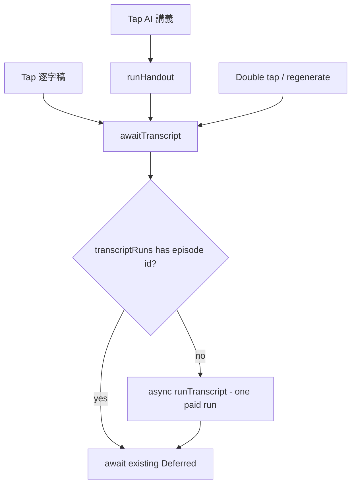

2026-07-07

# NerLan: concurrent triggers no longer transcribe the same episode twice

## What was broken

Transcription is the app's most expensive operation — audio download, transcode,
then a paid OpenAI transcription per ~20-minute chunk. Two paths could start it
for the same episode at the same time:

- `runHandout` needs a transcript, and called `runTranscript(record)` directly
  with no check for an already-running transcript job. Tapping AI 講義 while
  逐字稿 was mid-run launched a complete second transcription.
- The trigger guards check `_jobs` on the main thread, but the `Running` state is
  only set later inside the launched IO coroutine — so a fast double tap passed
  the guard twice.

Both runs then raced to write the transcript and cue files.

## Fix

Every path that needs a transcript goes through one funnel, `awaitTranscript`,
which keeps a per-episode `Deferred<String?>` in a synchronized map. The first
caller starts the run; everyone else awaits the same one. The entry removes
itself on completion (identity-checked), so a failed run doesn't block a retry.

A `Log.i` now marks the moment a run actually starts — it spends the user's
OpenAI quota, so it deserves a logcat line, and it is how the fix was verified.

## Verification

On the emulator with an invalid API key: tapped 逐字稿, then AI 講義 on the same
episode 3 seconds later (well inside the ~30 s run). Both buttons showed running
state and both failed together when the shared run failed — and logcat contained
exactly **one** `transcription run started` line.

Commit: `444032d` in nerlan-android.
