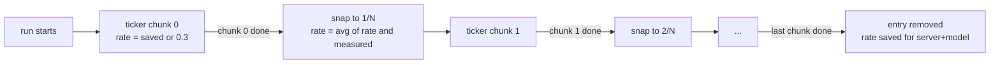

2026-08-28

# 逐字稿 button shows a percentage while transcribing

While a transcription runs, the 逐字稿 action button in the player kept its
spinner but its caption now reads `4%`, `12%`, … instead of the label — the same
readout the iOS `AIActionButton` shows. It answers the question the spinner alone
couldn't: is this going to take twenty seconds or ten minutes?

## The estimate

The port mirrors the iOS `transcriptProgress` logic:

- The chunk plan (`AudioTranscoder.chunkSeconds`) gives the scale: audio seconds
  per chunk, from the feed's duration. No known duration, no percentage.
- A **rate** — seconds of processing per second of audio — converts wall time into
  progress. On Android the rate covers everything the chunk waits on: transcode,
  upload, transcription and sentence cleanup, so it depends heavily on the network
  (an LTE uplink versus Wi-Fi). It is seeded at 0.3 and learned: each finished
  chunk blends its measured rate in for the next chunk's estimate, and each
  finished run stores the blended rate in `SharedPreferences` keyed by
  server + model, so the seed only matters the first time.
- A **ticker** coroutine publishes once a second while a chunk is in flight:
  `done + min(elapsed / expected, 0.95) × chunkSeconds`, over the total, capped at
  99%. The in-chunk cap means it never claims a chunk that hasn't come back; only
  real completion removes the entry. When a chunk finishes the value snaps to the
  chunk boundary and the next ticker starts.

`AIContentStore.transcriptProgress` is a `StateFlow<Map<episodeId, Float>>`;
`AiActionButton` collects it and swaps the caption when the job is running and
the kind is transcript. The compact (icon-only) variant is unchanged.

On the Hisense A7 the caption went 逐字稿 → 1% → 2% → 3% → 4% and the viewer opened
with the first chunk at 58 s (a 65-minute episode, 13 chunks). The seed rate was
pessimistic for that run — the first chunk took 50 s against an expected 90 — and
the learned rate corrects that from the second chunk on.
