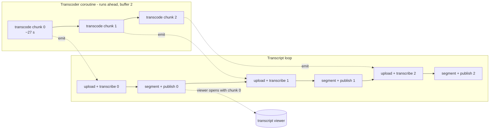

2026-08-28

# Transcription: 32 kbps audio, 5-minute chunks, transcode overlapped with upload

On the Hisense A7 over LTE, tapping 逐字稿 on a 13-minute podcast episode spun for
nine minutes and then failed with `api.openai.com 請求失敗（HTTP 500）`. The first
chunk's text now appears about 70 s after the tap, and later chunks keep appending
in the open viewer.

## What was slow

`AudioTranscoder` transcodes each episode to mono 16 kHz AAC before upload, the
Android counterpart of the iOS `SpeechAudioExporter`, whose purpose is to get under
OpenAI's 25 MB cap and keep uploads small. But it only ever called
`setAudioMimeType(AUDIO_AAC)` and never set a bitrate, so media3's
`DefaultEncoderFactory` used its default — `DEFAULT_AUDIO_BITRATE = 131072`, i.e.
128 kbps. For 16 kHz mono speech that is 4x the bytes for no benefit; a 13-minute
episode came out at ~13 MB, no smaller than the source MP3. The iOS exporter uses
`AVEncoderBitRateKey: 32_000`.

The phone's real uplink, measured from `/proc/net/dev` during the upload, was
~32 KB/s with the socket send queue pegged full the whole time. 13 MB at that rate
is ~7 minutes of multipart upload, after which the server answered 500. Two things
hid this: the transcoder logged nothing (a failed export silently fell back to
uploading the raw source), and the 20-minute chunk size meant nothing at all was
visible until the whole episode had gone round-trip.

The first suspect was the R8 change being tested at the time
([nerlan-android-media3-r8-keep-rule-scoped](nerlan-android-media3-r8-keep-rule-scoped.md)),
but the previous release build behaved identically on the same episode: same
transcode, same slow upload, same failure.

## What changed

1. **32 kbps AAC**, requested through `DefaultEncoderFactory` /
   `AudioEncoderSettings`, matching iOS. A 5-minute chunk is now ~1.5 MB on the A7
   (the device encoder lands around 42 kbps rather than exactly 32) instead of
   ~4.8 MB.
2. **5-minute chunks** (`MAX_CHUNK_SECONDS = 300`, was 1200). The gpt-4o-transcribe
   1400 s cap was the only reason for the old value; latency is the reason for the
   new one — the first chunk's text shows as soon as *it* has been transcoded,
   uploaded and transcribed.
3. **Transcode overlapped with upload.** `transcodeChunks` is now a `Flow<Chunk>`
   emitting each file as it is ready; `AIContentStore` collects it with
   `buffer(2)`, so the transcoder runs ahead in its own coroutine. Transcoding is
   CPU/codec work and uploading is network, so they no longer wait on each other.
4. **Observability.** Each transcode logs its output size and elapsed time, and a
   failed export logs the `ExportException`. A failed chunk of a long episode now
   throws with a message instead of falling back to uploading the whole source,
   which would exceed the API's limit anyway; a short episode keeps the fallback.

Measured on the A7 (two episodes were accidentally started at once, so this is
under double load): run started 02:44:00, chunk 0 transcoded at 02:44:30 (1562 KB,
27 s), chunk 1 transcoded at 02:44:52 while chunk 0 was uploading, viewer opened
with chunk 0's text at 02:45:08.

## Trade-off

More chunks means more sentence boundaries land on a cut, and each chunk costs one
extra `segmentTranscript` chat call. The old 20-minute chunks already accepted the
first; the second is a few seconds per chunk against minutes saved.
