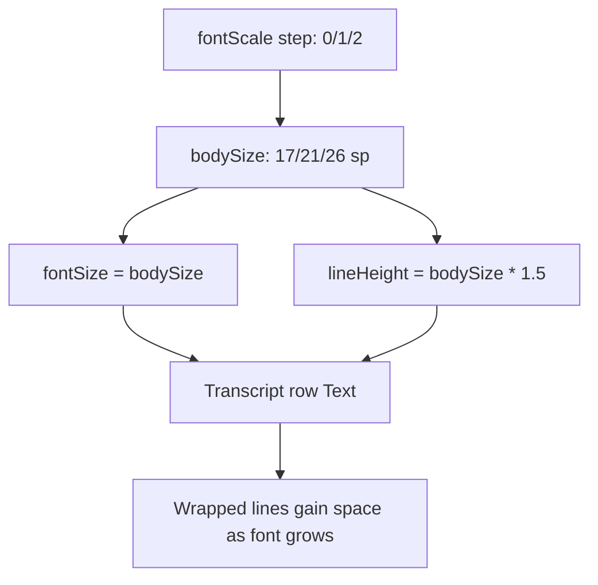

2026-06-26

# NerLan Android v1.5 — transcript line spacing scales with font size

Cut Android release **v1.5** (versionCode 5) to bring the Android app to the same release number as iOS, with one new improvement on top of the work already merged since v1.3.

## The change

In the transcript / caption reader, enlarging the font (the three-step font-size button: 17 / 21 / 26 sp) made wrapped lines crowd together — the rows set `fontSize` but never set an explicit `lineHeight`, so Compose kept the default about 1.2x line box even as the type grew. The fix scales line height with the font on both the original and translation `Text` rows:

```kotlin
Text(
  sentences[i],
  fontSize = bodySize.sp,
  lineHeight = (bodySize * 1.5f).sp,   // breathing room grows with the font
  ...
)
```

The translation row uses its own size (`bodySize` in translation-only mode, `bodySize - 2` in bilingual mode) and scales its `lineHeight` from that same value.

This mirrors the iOS change made the same day, where SwiftUI's additive `.lineSpacing(bodyFontSize * 0.3)` is applied to each row. iOS line spacing is *extra* space added on top of the natural about 1.2x line, so `0.3` there lands at roughly the same total line box as Compose's absolute `lineHeight = fontSize * 1.5`.



## The release

iOS already sits at 1.5 (it shipped 1.5 build 6 to TestFlight before this line-spacing work). The request was to align Android's release number, so Android jumps 1.3 → 1.5 (skipping 1.4) rather than tracking a parallel sequence. versionCode went 4 → 5.

The v1.5 GitHub release bundles everything merged since v1.3 (2026-06-19) — most notably the new shadowing practice mode with voice recording, progressive streaming of transcripts/translations, hardened segmentation, and assorted interface tidy-ups — with the line-spacing fix as the final addition. Built as a signed R8 release APK via the `browser.keystore` injected-signing flags and attached to the release; `main` was pushed first so the tag points at the shipped commit.
