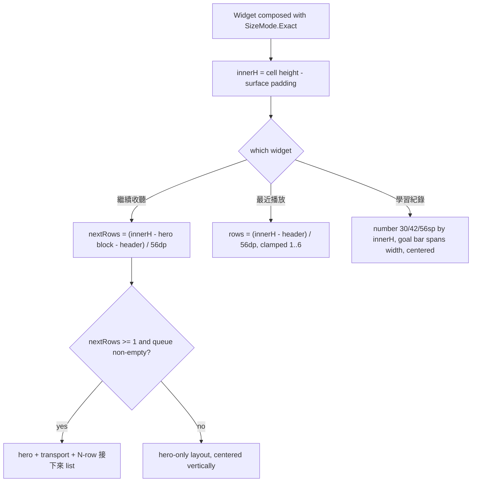

2026-08-09

# NerLan widgets: fill the cell instead of floating in it

Two related commits: the docs site's widget section gained real widget
screenshots in a card layout (`660dfe4`), and — prompted by what those very
screenshots exposed — the widgets themselves were reworked to stop wasting
their space (`e103328`).

## What was broken

Capturing the widgets for the docs made the problem impossible to ignore:
at the most common sizes, every widget except 我的節目 rendered a small,
top-aligned block and left the bottom third-to-half of its cell empty.

The root cause was `SizeMode.Responsive` with coarse buckets. Glance then
reports only the bucket size, not the real one, so layout decisions were
made against thresholds like "tall means ≥ 250dp":

- A 2-cell-high widget is ~224dp — it *just* missed the 250dp tall bucket,
  so 繼續收聽 never showed its 接下來 queue there even though a row fits,
  and 最近播放 hardcoded 2 rows where 3 fit.
- 學習紀錄 drew a 30sp number sized for the smallest cell no matter how
  much room it actually had.
- Everything was top-aligned, so whatever slack remained pooled at the
  bottom as visible dead space.

我的節目 didn't have the disease because an earlier change (see the
"我的節目 grid fill" commit) had already moved it to `SizeMode.Exact` with
grid math from the measured size — which is exactly the pattern the other
three now adopt.

## The fix

Concretely:

- **`SizeMode.Exact` everywhere.** Row counts and font sizes derive from
  the real cell height (`LocalSize` minus the 12dp surface padding), with a
  56dp estimate per list row that the clamps keep safe against drift.
- **繼續收聽** picks its layout by *what fits*, not by bucket: if at least
  one queue row fits under the hero + transport block, it renders the
  接下來 list sized to the space (hero cover trimmed 64→56dp so the
  common 2-cell height gains its first row). Otherwise it falls back to the
  wide/small hero layouts.
- **最近播放** computes its row count (now up to 6) instead of the fixed
  1/2/5 tiers.
- **學習紀錄** scales the minutes number 30/42/56sp with height, stretches
  the goal bar across the full width, and thickens it on tall cells.
- **Everything centers vertically**, so when content genuinely can't fill
  the cell (e.g. only two recent shows), the slack splits evenly and reads
  as breathing room rather than a hole.

Verified on the emulator by re-placing each widget and re-capturing: at
3×2, 繼續收聽 now shows hero + transport + one queued episode; 學習紀錄's
number dominates its 2×2 cell. The refreshed crops shipped straight into
the docs' widget cards — which themselves replaced a table whose narrow
first column had been wrapping the CJK widget names character by character
(fixed with a card grid plus `white-space: nowrap` on name headings and
table row names).
