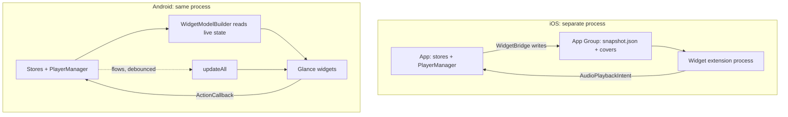

2026-07-26

# NerLan Android: widgets, resume positions, and recent shows

Ports the iOS 1.8 feature set ([nerlan-ios-widgets](nerlan-ios-widgets.md),
[nerlan-ios-resume-and-recent-shows](nerlan-ios-resume-and-recent-shows.md),
[nerlan-ios-widget-fixes-on-device](nerlan-ios-widget-fixes-on-device.md)) to the
Android app: four Glance home-screen widgets, per-episode resume, and a
recently-played list that can resume a whole course as a playlist.

## The one structural difference

On iOS the widget lives in a separate, sandboxed extension process. It cannot see
`Documents`, cannot touch `AVPlayer`, and must not hit the network — which is why
that build needs an App Group, a published `WidgetSnapshot`, exported cover
thumbnails, and a whole cache-invalidation story.

An Android app widget runs **inside the app's own process**. All of that
machinery simply evaporates: `WidgetModelBuilder` reads the live stores at render
time, and a button callback calls `PlayerManager` directly.

Two Android-specific wrinkles remain:

- A widget update can run in a process started **for that update alone**, where
  nothing has ever connected to `PlaybackService`. Playback state would read as
  empty and buttons would do nothing, so every widget entry point goes through a
  new `PlayerManager.awaitController`, which connects and waits (3s cap).
- `RemoteViews` caps the total bitmap payload it will ferry across processes and
  rejects hardware bitmaps outright, so covers load through Coil at 96–160px with
  `allowHardware(false)`. Coil's disk cache is already warm from the app's own
  lists, so this is normally a local read.

Position is deliberately **not** observed for updates. It ticks twice a second;
pushing a `RemoteViews` update at that rate would be wasteful, and unlike iOS
there is no timeline mechanism to extrapolate locally. The widgets show a
progress bar accurate as of the last real change (play/pause/track), which is
what an app widget can honestly promise.

## Resume positions — again an app-wide gap

As on iOS, checking what "continue where I left off" needed turned up that the
app never persisted a playback position at all. `PlaybackPositionStore`
(`playback-positions.json`) fixes it: written on pause, on episode change, and on
a 5-second throttle inside the *existing* 500ms poll loop, and seeded straight
into `setMediaItems(items, index, startMs)` on play. Auto-advance lands at 0, so
`onMediaItemTransition` re-seeks for `REASON_AUTO` — while repeat-one
deliberately restarts.

Same two honesty rules as iOS: positions within 15 s of either edge are cleared
rather than stored, and playing an episode to the end drops its entry.

`RecentShowsStore` (`recent-shows.json`) records which show and episode was last
played, from `play()` and `onMediaItemTransition` — every path playback can take.
It is kept separate from favorites because a course gets worked through for weeks
without ever being hearted.

## Ordering, and the picker

`我的節目` uses the ordering the iOS build arrived at the hard way: recently
played first, then listening time, with per-kind caps. Ranking on listening time
alone buries podcasts (favorited programs are more numerous and hold nearly all
the accumulated time), and pinning podcasts above programs merely inverts the
complaint.

Android has no system-provided widget editor, so pinning an explicit set needs a
configuration activity declared with `android:configure`. It is marked
`configuration_optional`, so the launcher can drop the widget straight onto the
home screen with automatic ordering and the picker is only for when you care.
The selection is stored as one newline-joined string in Glance's per-widget
preferences — a `stringSet` has no order, and here the order *is* the layout.

## What the emulator caught

Worth the detour, given the iOS widgets shipped a crash that only appeared at
runtime. Driving a real emulator found:

- **`getGlanceIdBy` throws** `IllegalArgumentException: Invalid AppWidget ID` for
  an id the host no longer knows. Reachable in practice: drag the widget off the
  home screen while its configuration screen is open, and saving crashes the app.
  The save path now wraps the lookup — losing the selection is fine, crashing is
  not. Same shape as the iOS `Dictionary(uniqueKeysWithValues:)` trap: an
  unguarded throwing call on a widget path.
- Confirmed working end to end: widgets place and render (empty state *and*
  populated), cover art loads, the resume button drives playback through
  `PlaybackService`, and the picker persists a selection to
  `appWidget-3.preferences_pb`.

One R8 note: a widget button stores its `ActionCallback` by class name and Glance
instantiates it reflectively. Glance's consumer rule keeps the classes; an
explicit `-keepclassmembers … { <init>(); }` pins the constructor too, without
which taps would silently do nothing in release builds only.

The version was left at 1.7 / versionCode 7 — cutting a release is a separate,
deliberate step.
