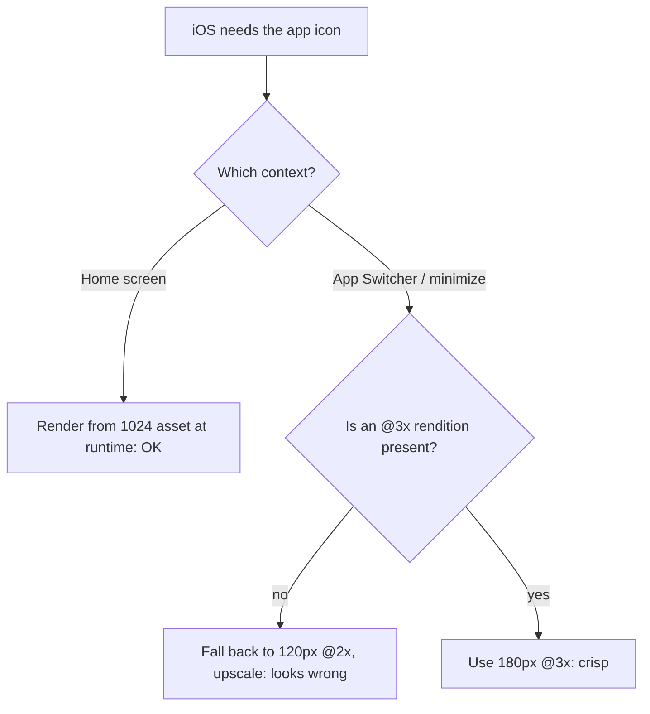

# NerLan — App icon rendered wrong while minimizing

## Problem

On the iPhone (an @3x device) the app icon looked correct on the Home screen but
rendered incorrectly during the minimize / App Switcher zoom animation — blurry
and wrong, not the crisp Home-screen icon.

## Root Cause

The `AppIcon.appiconset` contained a single 1024×1024 image (the modern
"single-size" app-icon model) and nothing else. As a result the compiled
`Assets.car` carried no per-scale renditions, and the build emitted no `@3x`
icon at all.

iOS 17 can rasterize the Home-screen icon from the 1024 asset at runtime, which
is why the Home screen looked fine. But the App Switcher / minimize zoom path
doesn't use that runtime rendering — on an @3x device it fell back to the only
small concrete icon available, the 120px `@2x` (`AppIcon60x60@2x`), and upscaled
it to the larger size the animation shows. Hence the icon looked wrong only there.

Separately, the source PNG carried an alpha channel (RGBA). Apple requires app
icons to be fully opaque; an alpha channel is grounds for App Store rejection and
can cause compositing artifacts in system surfaces.

## Solution

Regenerate a complete, opaque icon set from the 1024 master (dropping the alpha
channel by flattening to RGB, which is lossless here since every pixel was
already opaque). The set now covers all iPhone/iPad point sizes and scales,
including `60×60 @3x` (180px). After rebuilding, the compiled catalog carries 19
distinct renditions — `180×180 @3x idiom=phone` among them — and reports
`hasAlpha: no`.

Note: iOS caches app icons aggressively, so a sideloaded reinstall may keep
showing the old icon in the App Switcher until the cache refreshes — deleting and
reinstalling, or a reboot, clears it.

## Key Files

- `NerLan/Resources/Assets.xcassets/AppIcon.appiconset/Contents.json` — single
  1024 entry → full multi-size/scale entry list.
- `NerLan/Resources/Assets.xcassets/AppIcon.appiconset/icon-1024.png` — flattened
  to opaque.
- `NerLan/Resources/Assets.xcassets/AppIcon.appiconset/icon-{20,29,40,58,60,76,80,87,120,152,167,180}.png`
  — new per-size renditions.

## Lessons Learned

- The single-size 1024 app icon relies on runtime rendering that not every
  system surface uses; the App Switcher/minimize path wants real per-scale
  assets. Providing the full set (including `@3x`) is the safe choice.
- "Looks fine on the Home screen" doesn't mean the icon is configured correctly —
  different surfaces resolve the icon through different paths.
- App icons must be opaque (no alpha). Flattening an already-opaque RGBA image to
  RGB is lossless and avoids the alpha entirely.
- Verify the *compiled* `Assets.car` with `assetutil --info`, not just the source
  asset — that's where missing renditions show up.
