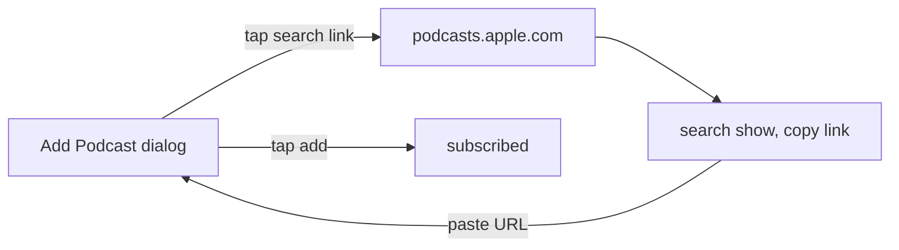

2026-07-12

# Add Podcast dialog: quick link to search shows on Apple Podcasts

Subscribing to a podcast in NerLan is paste-a-URL only: the "新增 Podcast" dialog accepts an Apple Podcasts link or a raw RSS feed URL, but offers no way to *find* that URL. In practice the user had to leave the app, remember to open podcasts.apple.com, search, copy the link, and come back. This change shortens that loop by putting the jump-off point inside the dialog itself.

Both apps gained a tappable "到 Apple Podcasts 搜尋節目" row (magnifying-glass icon) below the URL field, plus a hint line explaining the round trip: search the show, copy its link, paste it back.

## iOS (`plateaukao/nerlan`, af49a5f)

`AddPodcastView` gets a second `Form` section with a SwiftUI `Link` to `https://podcasts.apple.com` and a footer hint. One caveat surfaced during design: `podcasts.apple.com` is a universal link, so on a device with the stock Apple Podcasts app installed, iOS hands the tap to that app rather than the default browser. The flow still works there (search → share → copy link), so we shipped the simple `Link` first; if the hand-off proves annoying, the fallback is an in-app `SFSafariViewController` sheet, which never triggers universal links.

## Android (`plateaukao/nerlan-android`, becd921)

`AddPodcastDialog` mirrors the same row using `LocalUriHandler.openUri(...)`, which opens the default browser — Android has no Apple Podcasts app to intercept, so no universal-link concern there. Verified by a signed-release build; the physical phone was not connected, so on-device verification is pending (the release APK is ready at `app/build/outputs/apk/release/app-release.apk`).
