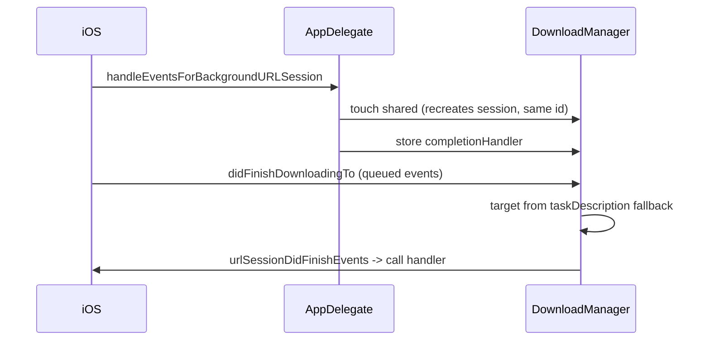

2026-07-07

# NerLan: background downloads survive app termination

## What was broken

`DownloadManager` deliberately uses a background `URLSessionConfiguration` so episode downloads keep running when the app is suspended or killed. But the plumbing that makes that useful was missing:

- The `taskIdentifier → episode/attachment` map lived only in memory. When the system relaunched the app to deliver a finished download, `didFinishDownloadingTo` couldn't tell what the file was and its `guard` **silently discarded it** — the download completed, the bytes arrived, and they were thrown away.
- No `handleEventsForBackgroundURLSession` hook existed (pure SwiftUI app, no app delegate), so the system's relaunch completion handler was never stored or called.
- After a normal relaunch with downloads still in flight, the `downloading` set was empty — rows showed the download button again, and tapping it started a second task for the same episode.

## Fix

- **`taskDescription` carries the target.** Each download task stores its `TaskTarget` (episode record or attachment) base64-JSON-encoded in `taskDescription` — a string the system persists with the task across process death. The delegate methods fall back to it when the in-memory map misses, so a post-relaunch completion files the audio under the right episode id and appends the record as usual.
- **`init` reconnects via `getAllTasks`.** On every launch the manager rebuilds the task map and the per-episode `downloading` spinners from the session's still-running tasks, so the UI reflects reality and duplicate downloads can't be started.
- **`AppDelegate` + `urlSessionDidFinishEvents`.** A minimal `UIApplicationDelegateAdaptor` stores the background completion handler; the session delegate invokes it after the queued events are delivered, as the background-session contract requires.
