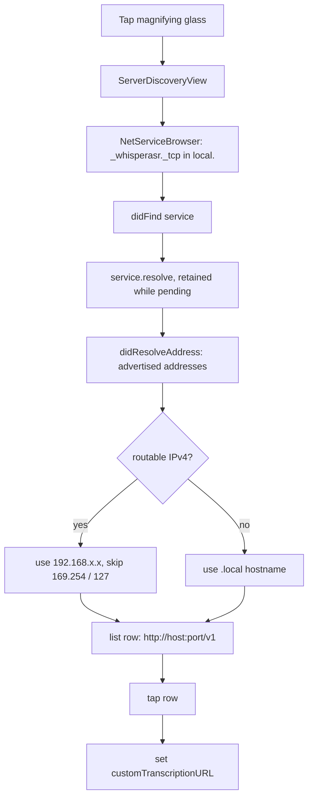

# NerLan — Bonjour discovery for the custom transcription server

## Summary

The custom transcription provider (see the
[custom OpenAI-compatible API provider](nerlan-custom-api-provider.html) change)
requires the user to type the server's `http://host:port/v1` URL by hand, which
means hunting down the Mac's LAN IP. This adds a magnifying-glass button next to
that field; tapping it browses the local network for whisperASR servers
advertising Bonjour **`_whisperasr._tcp`** (the same service
`dns-sd -B _whisperasr._tcp` lists), and fills the URL in on selection.

## Approach

Three pieces — a browser, a sheet, and the Info.plist declarations iOS requires.

**`BonjourBrowser`** uses `NetServiceBrowser` rather than the newer `NWBrowser`.
The deciding factor: a Bonjour *browse* result only carries the service name, and
`NWBrowser` would need a throwaway `NWConnection` per result to resolve a
host:port, with `@Sendable` state-update closures capturing the browser. The
older `NetServiceBrowser` resolves straight to host + port through its delegate,
and because the object is a SwiftUI `@StateObject`, those delegate callbacks land
on the main run loop — so `@Published` updates are already on the main thread and
there's no concurrency-closure friction. Found services are retained in a set
while they resolve (a `NetService` that isn't held is dropped mid-resolve).

**Address selection** turned out to be the subtle part. A Mac advertises *every*
interface's address, so the first resolved IPv4 was a `169.254.x.x` link-local
(from an inactive USB/Thunderbolt-bridge interface) — not reachable from the
phone. The resolver now collects all advertised IPv4 addresses and prefers a
**routable** one, skipping `169.254/16` (link-local) and `127/8` (loopback);
only if none is routable does it fall back to the `.local` hostname (mDNS then
picks the right interface), and a link-local address is the last resort.

**`ServerDiscoveryView`** is the sheet: a spinner with guidance while no servers
have answered, then a tappable list that streams in as each resolves. It starts
browsing on appear and stops on disappear, so the local-network access ends with
the sheet.

**Info.plist** (generated from `project.yml`) gains `NSBonjourServices`
(`_whisperasr._tcp`) and `NSLocalNetworkUsageDescription`. Without both, iOS
silently returns no results and never even prompts for local-network permission.

One SwiftUI gotcha shaped the final wiring: the sheet was first attached to the
`Section` inside the conditionally-rendered custom-provider view builder. Flipping
the presentation state re-evaluated the body, gave that Section a new identity,
and the sheet presented then dismissed itself in the same frame. Moving
`.sheet(...)` up to the stable `Form` level (beside the existing confirmation
dialogs) fixed it.

## Trade-offs

- **`NetServiceBrowser` over `NWBrowser`.** The former is the older API, but it's
  not deprecated on iOS 17 and gives host:port directly. `NWBrowser` is the
  "modern" choice yet needs an extra connection-based resolve step and Sendable
  plumbing for no functional gain here.
- **Prefer IP, not the `.local` name, for the common case.** A resolved dotted
  IPv4 needs no mDNS lookup when the request is later made, which is steadier
  than embedding `host.local` in the URL — at the cost of the link-local
  filtering logic above. The hostname remains the fallback when no routable IPv4
  resolved.
- **Client-only.** This is the discovery half; whisperASR must actually publish
  `_whisperasr._tcp` on the LAN (and bind to the LAN interface, not just
  loopback) for anything to appear. Scoped deliberately to NerLan.
- **No manual rescan / timeout UI.** The sheet browses continuously while open;
  there's no "nothing found, retry" terminal state. Simpler, and re-opening the
  sheet restarts the browse.

## Key Files

- `NerLan/Sources/BonjourBrowser.swift` — `NetServiceBrowser`/`NetServiceDelegate`
  discovery and resolve, the routable-IPv4 selection, and the `Server` model that
  exposes `http://host:port/v1`.
- `NerLan/Sources/Views/ServerDiscoveryView.swift` — the discovery sheet
  (browse-on-appear, stop-on-disappear, streaming list).
- `NerLan/Sources/Views/SettingsView.swift` — the magnifying-glass button on the
  transcription URL field and the `Form`-level sheet presentation.
- `project.yml` / `NerLan/Resources/Info.plist` — `NSBonjourServices` and
  `NSLocalNetworkUsageDescription`.
