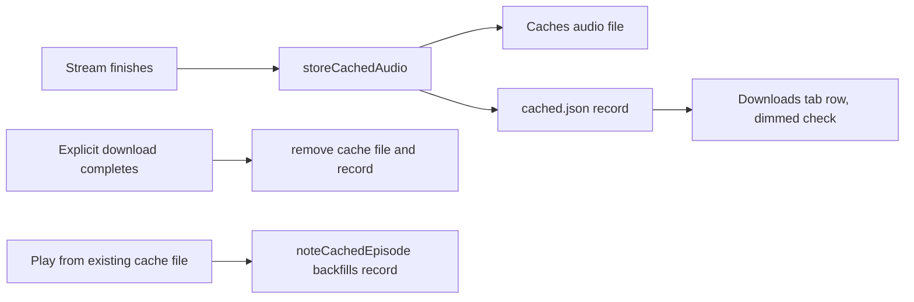
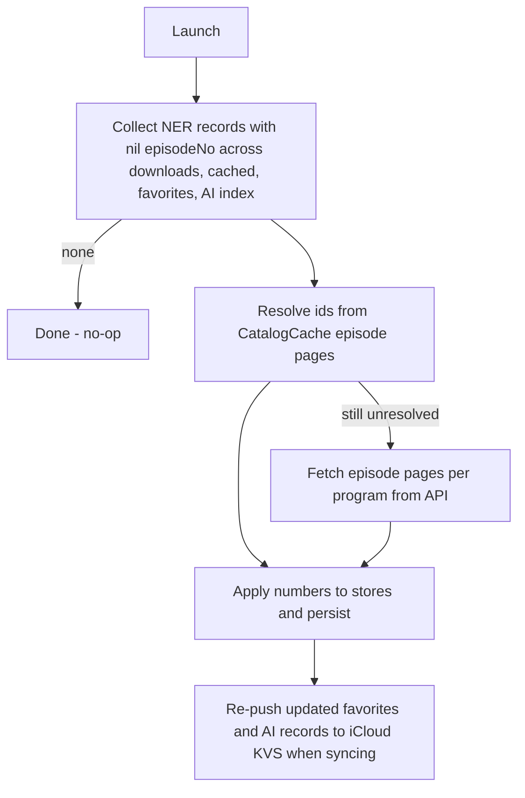

2026-07-29

# NerLan iOS: cached episodes in the Downloads tab, episode-number sorting

Two related quality-of-life changes to the offline lists.

## Cached episodes surface in 下載

The app has an opt-in streamed-audio cache: when an episode is streamed to the
end, the fully-buffered file is kept in `Caches/audio/` so replays are free.
Until now those captures were invisible — playable, but listed nowhere — while
explicit downloads lived alone in the Downloads tab.

The cache was file-only (`{episodeId}.mp3`), so there was no metadata to render
a row from. `DownloadManager` now keeps a second record list, `cached.json` in
Documents, mirroring the cache the same way `downloads.json` mirrors explicit
downloads. The audio itself deliberately stays in Caches: it remains purgeable
and out of iCloud backups, and the record list is pruned against the actual
files on every launch, so a system purge just makes rows disappear.

In the tab, every row now carries a trailing badge: green `checkmark.circle.fill`
for a real download, the same icon dimmed (tertiary) for a cache capture. A
filter menu beside the grouping toggle — in the sidebar header on Mac — narrows
to 全部 / 已下載 / 快取, defaulting to both. Swipe-delete works on cached rows
(removes file + record), and an explicit download supersedes and removes the
cached copy as before.

Files cached before records existed can't be listed retroactively (no metadata),
but playing one registers its record via `noteCachedEpisode`, so the tab heals
as old cache entries get replayed.

## Sorting by episode number, not date

The Downloads and AI tabs sorted grouped episodes by `playDate`. That looked
like "download/generation order" to the user because Channel+ bulk-publishes
course episodes with a single shared release date — equal keys, so the sort
degenerated to insertion order.

The API has always returned `episodeNumber` per episode (the episode-list
endpoint even sorts by it server-side); the app just never persisted it on
`EpisodeRecord`. The record now carries an optional `episodeNo` — optional so
old `favorites.json` / `downloads.json` / AI `index.json` still decode, per the
project's no-migration rule — and `groupRecords` sorts by episode number first,
falling back to release date (right for podcasts, which have no numbers), then
title.

### Backfilling old records

New records get the number at conversion time, but everything already persisted
decodes with `episodeNo = nil` and would have stayed wrongly sorted — the first
on-device test showed exactly that. A launch-time migration
(`EpisodeNumberBackfill`) fixes stored records once:

The catalog cache (each browsed program's episode pages, on disk) resolves most
ids offline; only programs it doesn't cover cost an API sweep. Because results
are persisted, the whole thing short-circuits to a no-op on later launches. The
KVS write-through matters: favorites adoption replaces the local set wholesale
from KVS, so numbers not pushed up would be clobbered again on the next remote
change.

The matching Android app gets the same treatment next.
