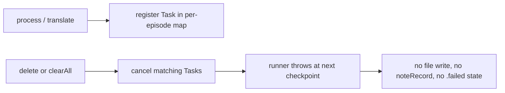

2026-07-07

# NerLan: AI jobs are cancellable — cleared content stays cleared

## What was broken

`processTranscript` / `processHandout` / `translate` launched their work as fire-and-forget `Task`s. Nothing held a reference, so nothing could cancel them. The failure mode:

1. User starts a transcription (multi-minute job: download audio, transcode, chunked OpenAI calls).
2. User runs 清除所有 AI 內容 (or deletes that one transcript).
3. The job, unaware, finishes: writes the transcript file, `noteRecord` re-adds the episode to the index, and — with sync on — pushes it back to iCloud KVS and Google Drive.

The "cleared" content resurrects, and the OpenAI spend continues for output the user already discarded.

## Fix

- **Task maps.** The transcription map already existed (added for the duplicate-transcription fix); handouts and translations now register the same way. Entries self-remove on completion with an identity check, so a cancelled run can't evict the replacement task that a 重新產生 installed at the same key.
- **Cancellation triggers.** `delete(.transcript)` cancels the transcription *and* the translation job (translations derive from the transcript, whose sidecars the delete already removes); `delete(.handout)` cancels the handout job; `clearAll` cancels everything before clearing state.
- **Cancellation-aware runners.** Each runner calls `Task.checkCancellation()` at chunk/part boundaries and immediately before writing its output; URLSession calls already throw on cancellation mid-request. The catch blocks skip writing `.failed` when the task was cancelled — the delete path already cleared the job entry, and a phantom error badge would otherwise appear on the button.
