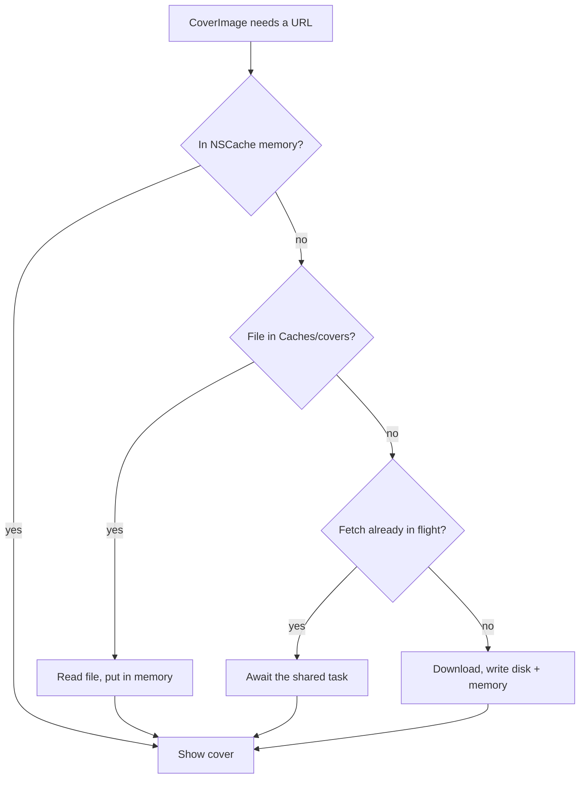
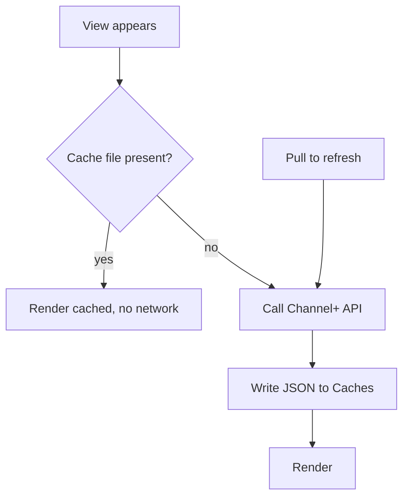

# NerLan — Cache catalog and covers on disk; add episode pull-to-refresh

## Summary

The browse UI re-fetched everything, every time. The program list reloaded on
each cold launch, the episode list re-fetched on every navigation into a
program, and cover thumbnails were re-pulled over the network on each launch.
The Channel+ catalog rarely changes (sequential language courses gain episodes
only at the end), so this was wasted traffic and a slow, network-dependent UI.

This change makes the catalog and cover images persist on disk so the UI renders
instantly — including offline — and only touches the network on a true cache
miss or an explicit pull-to-refresh.

## Approach

Three caches, all in the `Caches` directory (derived, re-fetchable data — kept
out of iCloud backups; the OS may purge it, after which the next launch simply
re-fetches). User data — favorites, downloads — stays in `Documents` as before.

- **`CatalogCache`** — plain-JSON disk cache for the program list
  (`programs.json`) and each program's loaded episode pages
  (`episodes-{programId}.json`). Views read the cache first and only call the API
  on a miss or a refresh. `Episode` was changed from `Decodable` to `Codable` so
  pages can be persisted. The episode cache stores the pagination cursor (page /
  totalPages / totalCount) alongside the episodes, so reopening a program
  restores the list and infinite scroll resumes without re-fetching seen pages.

- **Pull-to-refresh** added to `ProgramDetailView` (the program list already had
  it). Episodes are ascending (oldest first), so refresh re-fetches from page 1
  and a higher total count surfaces newly-added episodes as the user scrolls
  back down. `ProgramListView` now keeps the cached list on screen if a refresh
  fails, instead of blanking to an error view.

- **`CoverImageCache`** — an explicit two-tier (in-memory `NSCache` + on-disk
  `Caches/covers/{key}`) store that replaces `AsyncImage`/`URLCache` inside
  `CoverImage`. This was the root of the "covers re-download on every launch"
  symptom: the image endpoint sends `ETag`/`Last-Modified` but **no
  `Cache-Control`**, so `URLCache` treats every cover as needing revalidation and
  makes a network round-trip on each cold launch. The explicit store writes a
  fetched cover to a file keyed by the endpoint's `key` id and reads it straight
  from disk forever after — zero network — deduping concurrent fetches (many
  episode rows share one program cover) through an in-flight task map.

The catalog/cover caches are app-managed, so the API requests themselves must
never be served stale: `ChannelPlusAPI.get` and the cover fetch both use
`.reloadIgnoringLocalCacheData`, bypassing `URLCache` entirely.

Cover load decision flow:

Catalog load flow (program list and episode pages):

## Trade-offs

- **Staleness is intentional.** The catalog is treated as authoritative until the
  user pulls to refresh. For a catalog that changes rarely this is the right
  default; refresh is the escape hatch.
- **Refresh resets episode pagination.** Pull-to-refresh re-fetches from page 1
  rather than re-validating every loaded page. Because episodes are ascending,
  newly-added ones appear at the end, so the user scrolls to reach them after a
  refresh. A "jump to latest" refresh would be more work for little gain given
  how seldom episodes are added.
- **Covers stored at full resolution.** The endpoint returns ~1 MB PNGs shown at
  thumbnail sizes; the cache stores the original bytes (simple, matches prior
  behavior) rather than downsampling. `Caches` placement bounds the cost — the OS
  reclaims it under pressure.
- **No cache invalidation for covers.** A cover is keyed by its image id and kept
  indefinitely; if the server replaces art under the same key it won't be picked
  up. Acceptable for static program artwork.

## Key Files

- `NerLan/Sources/CatalogCache.swift` (new) — disk cache for programs + episode
  pages.
- `NerLan/Sources/CoverImageCache.swift` (new) — two-tier cover image store.
- `NerLan/Sources/Models.swift` — `Episode` made `Codable`.
- `NerLan/Sources/NERAPI.swift` — API GETs bypass `URLCache`.
- `NerLan/Sources/Views/ContentView.swift` — `CoverImage` now backed by
  `CoverImageCache`.
- `NerLan/Sources/Views/ProgramListView.swift` — cache-first load; resilient
  refresh.
- `NerLan/Sources/Views/ProgramDetailView.swift` — cache-first load; pull-to-
  refresh; persists each page.
