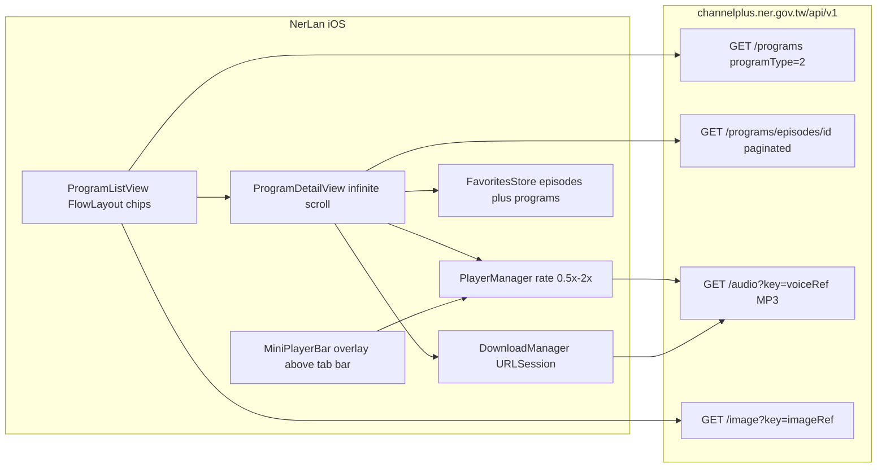

# NerLan — migrate to Channel+ API for full episode archives

## Summary

Switched NerLan's backend from the www.ner.gov.tw LearnLanguage API to NER's Channel+ on-demand platform (`https://channelplus.ner.gov.tw/api/v1`). The old API only exposed episodes of currently-airing programs month by month; Channel+ serves the complete archive of every program ever published — 96 programs in 19 languages (up from 68/17), including 臺灣台語, 臺灣客語, and 原住民族語言. The same change also added playback speed control (0.5×–2×), program-level favorites, wrapped language-filter chips, and a mini player that floats above the tab bar. Pushed to private repo `plateaukao/nerlan`.

## Approach

**API discovery, two techniques.** Static analysis of the Nuxt bundles located the service module (`getProgramsList`, `getEpisodeListOfProgram`, `getVoiceUrl`) with exact URL shapes and the array-parameter encoding (`tagIds=["uuid"]`). CDP-driven headless Chrome (the site is SSR'd, so page loads make no XHR; clicking a filter tag in the live DOM does) confirmed behavior and surfaced the `/api/proxy?url=` pattern. Key endpoints:

- `GET /programs?page=&size=&programType=2&tagIds=[...]` — language programs are `programType=2`; language/difficulty filters are tag UUIDs; `size=500` returns the whole catalog in one page
- `GET /programs/episodes/{programId}?page=&size=&sortOrder=ASC&sortField=episode_number` — full archive, real pagination
- `GET /audio?key={voiceRef}` — **direct MP3 with range support**, unlike the old Wowza HLS streams
- `GET /image?key={imageRef}` — covers
- Response envelope: `{rtnCode: "0000", rtnMsg, data, pagination}`

**Direct MP3 simplified two subsystems.** Playback still uses AVPlayer, but downloads dropped `AVAssetDownloadURLSession` (HLS packaging, device-only) for a plain background `URLSession` download to `Documents/audio/{episodeId}.mp3` — less code and testable in the simulator.

**Episode ordering.** Channel+ defaults to newest-first; the app requests `sortOrder=ASC` because language courses are sequential (EP1 first), with infinite-scroll pagination in the detail view.

**Speed control.** `AVPlayer.defaultRate` (so `play()` resumes at the chosen rate) plus `rate` when already playing; persisted in UserDefaults; reported to `MPNowPlayingInfoCenter` so the lock screen scrubs correctly at non-1× speeds.

**Program favorites.** `Program` became `Codable` and is stored verbatim in `favorite-programs.json`, so the 收藏 tab can navigate straight into a `ProgramDetailView` without refetching.

**Mini player hit-testing.** `safeAreaInset(edge: .bottom)` content over a `List` did not receive touches in this layout — taps passed through to list rows beneath the bar. Replaced with `.overlay(alignment: .bottom)` on the TabView padded above the tab bar height. (Synthetic CDP-style taps in the simulator continued to behave ambiguously; on-device testing confirmed the overlay bar receives taps correctly — worth remembering that simulator tap injection can misattribute hits around overlaid views.)

## Trade-offs

- **Catalog source switch, not addition.** The www API was dropped entirely rather than merged; Channel+ is a superset for archives, but any www-only metadata (broadcast schedule times) was given up.
- **Favorites/downloads from the old build don't migrate.** Episode IDs differ between the two APIs (Channel+ UUIDs vs www numeric IDs), so prior local records simply won't resolve; acceptable at this stage of the app's life.
- **List content scrolls behind the floating mini player.** The overlay doesn't reserve layout space the way safeAreaInset did; the last list row can be obscured until scrolled. Chosen because working taps beat perfect insets.
- **Language chips come from loaded programs**, not the tag vocabulary endpoint — guarantees no empty filter, at the cost of not showing languages NER defines but has no programs for.

## Key Files

- `NerLan/Sources/NERAPI.swift` — `ChannelPlusAPI`: endpoints, audio/image URL builders
- `NerLan/Sources/Models.swift` — Channel+ envelope (`rtnCode`), `Program`/`Episode`/tags, `EpisodeRecord`
- `NerLan/Sources/DownloadManager.swift` — plain URLSession MP3 downloads
- `NerLan/Sources/PlayerManager.swift` — playback rate support
- `NerLan/Sources/FavoritesStore.swift` — episode + program favorites
- `NerLan/Sources/Views/ProgramListView.swift` — `FlowLayout` wrapped chips
- `NerLan/Sources/Views/ProgramDetailView.swift` — infinite-scroll archive, program heart
- `NerLan/Sources/Views/ContentView.swift` — overlay mini player above tab bar
- `NerLan/Sources/Views/PlayerView.swift` — speed menu
