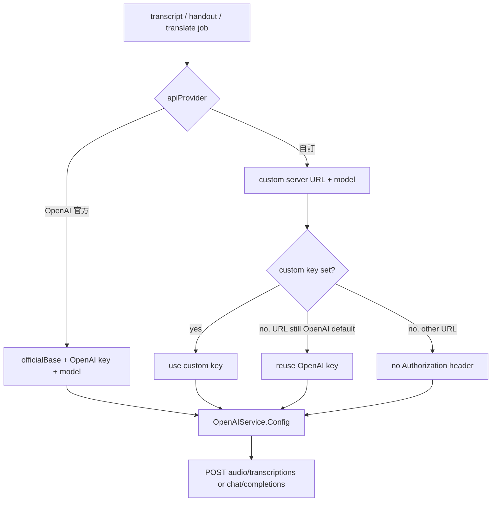

# NerLan — Custom OpenAI-compatible API provider

## Summary

NerLan's AI features (transcription, study handouts, sentence segmentation, and
translation) previously called OpenAI directly with a single API key and a
couple of model names. Transcription in particular is costly, so this change
lets the user point those features at **their own OpenAI-compatible servers**
instead — for example a self-hosted whisper.cpp server on the LAN for
transcription, or a local LLM for handouts/translation.

Settings now offers an **API 來源** picker with two modes:

- **OpenAI 官方** — the existing key + model fields, unchanged.
- **自訂** — two *independent* endpoints, because the app hits two different
  OpenAI routes: one for transcription (`/audio/transcriptions`) and one for the
  chat-based work (`/chat/completions`, used by handouts, translation, and
  sentence segmentation). Each endpoint has its own server URL, model name, and
  optional bearer key.

Both providers' settings persist separately, so switching back and forth is
lossless. Each custom endpoint has a **verify** button that sends a tiny live
request and reports readiness inline.

## Approach

The API layer was already stateless (`OpenAIService`), with the caller passing
in the model and key per call. The only thing hardwired was the base URL
(`https://api.openai.com/v1`). The refactor replaces the per-call
`model:`/`apiKey:` pair with a single `Sendable` value type:

```
struct Config { baseURL: URL; apiKey: String; model: String; requiresKey: Bool }
```

`SettingsStore` resolves which `Config` to hand over based on the active
provider, exposing `transcriptionConfig` and `chatConfig`. `OpenAIService` stays
oblivious to which provider is active — it just uses `config.baseURL`,
`config.apiKey`, and `config.model`.

Two provider-specific behaviours live entirely in the resolution step, keeping
the network layer simple:

- **Optional key.** `requiresKey` is `true` only for the official endpoint. For
  custom, an empty key omits the `Authorization` header entirely, which is what
  keyless local servers (whisper.cpp, LM Studio, Ollama) want.
- **Key inheritance.** Since the custom URL fields *default* to the OpenAI base
  (a ready-to-edit template), an unset custom key reuses the OpenAI-mode key
  *while the URL is still OpenAI's*, and sends nothing once the URL is changed to
  a different host. So custom mode is usable out of the box with the existing
  key, and the secret is never duplicated into a second store.



**Readiness probes.** A first integration against a real custom server (a
self-built whisper.cpp HTTP server) surfaced how opaque failures were, so two
probes were added. `verifyTranscription` POSTs a generated ~0.5 s silent WAV and
only checks the HTTP status — it deliberately does *not* reuse `transcribe`,
which treats an empty transcript as a decode failure (silence legitimately
transcribes to nothing). `verifyChat` does a one-token chat round-trip. The UI
shows a spinner / green check / red error per endpoint and auto-resets when that
endpoint's URL, model, or key changes.

**Diagnosable errors.** The old failure path collapsed any non-2xx into a bare
"OpenAI 請求失敗（HTTP n）". `check()` now reports the **host**, status, and a
snippet of the response body, and parses `{"error":"..."}` / `{"message":"..."}`
bodies in addition to OpenAI's nested `{"error":{"message":...}}` shape. This is
what let a real failure (a server returning HTTP 500 because it couldn't decode a
WebM source upload) be read at a glance instead of guessing.

## Trade-offs

- **Two endpoints, not one.** A custom provider could have been a single
  base URL, but transcription and chat are genuinely separate concerns (a LAN
  whisper box has no chat endpoint, and vice-versa). Splitting them costs more
  UI but matches reality; the verify buttons make the split legible.
- **Transcription jobs are still not serialized app-wide.** Within one episode,
  chunks are transcribed sequentially, but two different episodes (or a
  transcript + handout on the same episode) can still hit the server
  concurrently. Against a single-queue local server that means a later request
  waits with no bytes flowing and can trip the client's 5-minute idle timeout.
  Left as-is for now; a single-flight queue is the follow-up if it bites.
- **Key inheritance is string-exact.** "URL is still OpenAI's" compares the
  trimmed string against the default. A trailing slash or different casing would
  defeat it and send no key. Acceptable because the field is pre-filled with the
  exact default; anyone editing it to a real custom server wants their own key
  anyway.
- **`requiresKey` lives on `Config`, not the service.** It keeps `OpenAIService`
  from knowing about "official vs custom", at the cost of one more field on the
  value passed in. Worth it to keep the network layer provider-agnostic.

## Key Files

- `NerLan/Sources/OpenAIService.swift` — `Config` type, base-URL threading
  through `transcribe`/`generateHandout`/`segmentTranscript`/`translateSentences`/`chat`,
  the `verifyTranscription`/`verifyChat`/`silentWAV` probes, and the richer
  `check()` error reporting.
- `NerLan/Sources/SettingsStore.swift` — `APIProvider` enum, the custom
  URL/model/key fields (URLs/models in UserDefaults, keys in the Keychain),
  `transcriptionConfig`/`chatConfig` resolution, and the key-inheritance helper.
- `NerLan/Sources/Views/SettingsView.swift` — the 來源 picker, the official vs
  custom sections, the verify rows with inline status, and the dynamic key
  placeholder.
- `NerLan/Sources/AIContentStore.swift` — call sites updated to pass
  `settings.transcriptionConfig` / `settings.chatConfig`.
