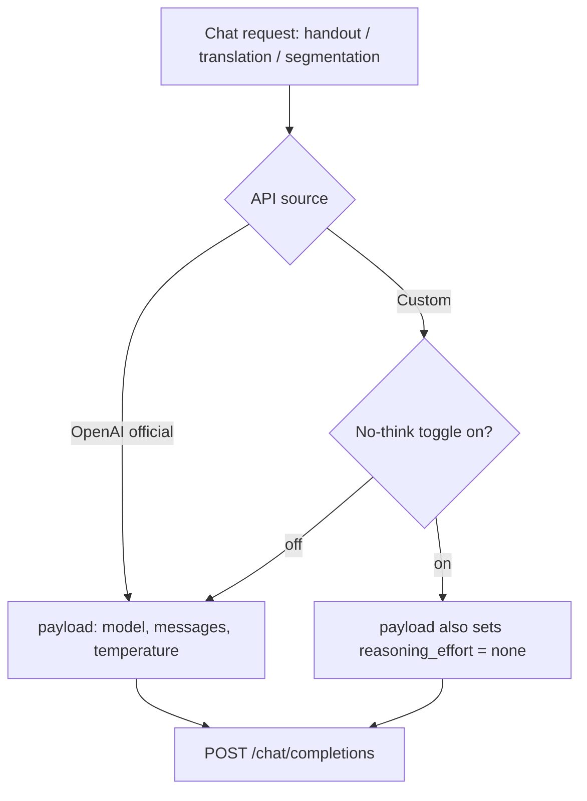

2026-06-21

# NerLan: a "no think" toggle for the custom (Ollama) chat server

NerLan's AI features (handout, translation, sentence segmentation) can be pointed
at a user-supplied OpenAI-compatible chat server instead of OpenAI itself — most
often a local Ollama instance on the LAN. The problem: Ollama auto-enables
"thinking" for any capable model (qwen3, deepseek-r1, gpt-oss, …) when the request
doesn't say otherwise. That reasoning then both slows generation and leaks into the
output — a handout comes back with the model's chain-of-thought wrapped around (or
instead of) the HTML fragment we asked for, and a translation gets prefixed with
deliberation.

This change adds an opt-in **停用思考模式（no think）** toggle to the custom
chat-server settings that turns thinking off for that server's requests.

## How thinking gets disabled

The right switch depends on the endpoint, and the only one Ollama honors on its
**OpenAI-compatible** `/v1/chat/completions` is `reasoning_effort: "none"`:

- Ollama's *native* `/api/chat` accepts `think: false`, but the OpenAI-compatible
  endpoint silently ignores it.
- A boolean `reasoning_effort` is rejected outright (`cannot unmarshal bool … into
  string`); it must be the string `"none"`.

NerLan only ever talks to the OpenAI-compatible endpoint (it shares one code path
with the official OpenAI provider), so `reasoning_effort: "none"` is the correct —
and only — lever. Confirmed against the Ollama issue tracker
(ollama/ollama#14820, #15288, #12004).

## Why a toggle, scoped to the custom provider

It is off by default and never applied to the official OpenAI path:

- OpenAI's `gpt-4o` would reject an unexpected `reasoning_effort` field, so the
  official provider must never send it.
- A custom server that isn't a thinking model doesn't need it either, so the user
  opts in only when their Ollama model actually thinks.

## What changed

- **`OpenAIService.swift`** — `Config` gains `disableThinking` (default `false`);
  `chat()` adds `payload["reasoning_effort"] = "none"` when it's set. Harmless to
  servers that ignore the field, and only sent on opt-in.
- **`SettingsStore.swift`** — a persisted `customChatNoThink` (UserDefaults, off by
  default), plumbed into the custom branch of `chatConfig`.
- **`SettingsView.swift`** — the toggle in the 講義／翻譯伺服器 section, a footer
  note, and an `.onChange` that resets the server-verify state when it flips (so the
  "驗證" probe re-runs the no-think request).

Because `verifyChat` reuses `chat()`, the settings "驗證講義／翻譯伺服器" button
exercises the no-think request too, so the user can confirm it end-to-end before
generating real content.
