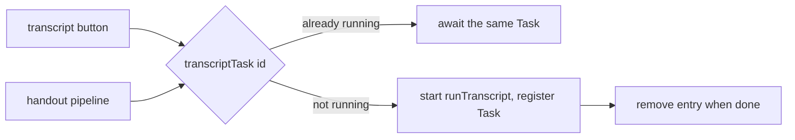

2026-07-07

# NerLan: share one in-flight transcription across concurrent callers

## What was broken

Two UI paths can need the same episode's transcript at the same time:

- the 逐字稿 button → `processTranscript` → `runTranscript`
- the AI 講義 button → `processHandout` → `runHandout`, whose first step is `await runTranscript(record)` (a handout is generated *from* the transcript)

`processTranscript` guards on "no job recorded for this episode", but `runHandout` called `runTranscript` **directly**, and `runTranscript` itself deduped only on the *saved file*. So: tap transcript (job starts, no file yet), then tap handout → a second complete pipeline — audio download, transcode into about 20-min chunks, per-chunk OpenAI transcription, sentence re-segmentation — ran in parallel with the first. Both runs wrote the same `jobs[transcript-<id>]` entry, the same `partialTranscripts[id]` streaming state, and finally the same transcript/cues files. Besides the racing state, the OpenAI transcription bill was paid twice.

## Fix

A per-episode task map turns "start a transcription" into "get *the* transcription":

`transcriptTask(_:)` returns the running `Task<String?, Never>` for the episode if one exists, else starts `runTranscript` inside a new task and registers it. The entry removes itself when the run completes — success or failure — so a failed run can be retried. `processTranscript` and `runHandout` both go through it; everything stays on the main actor, so no extra locking is needed.
