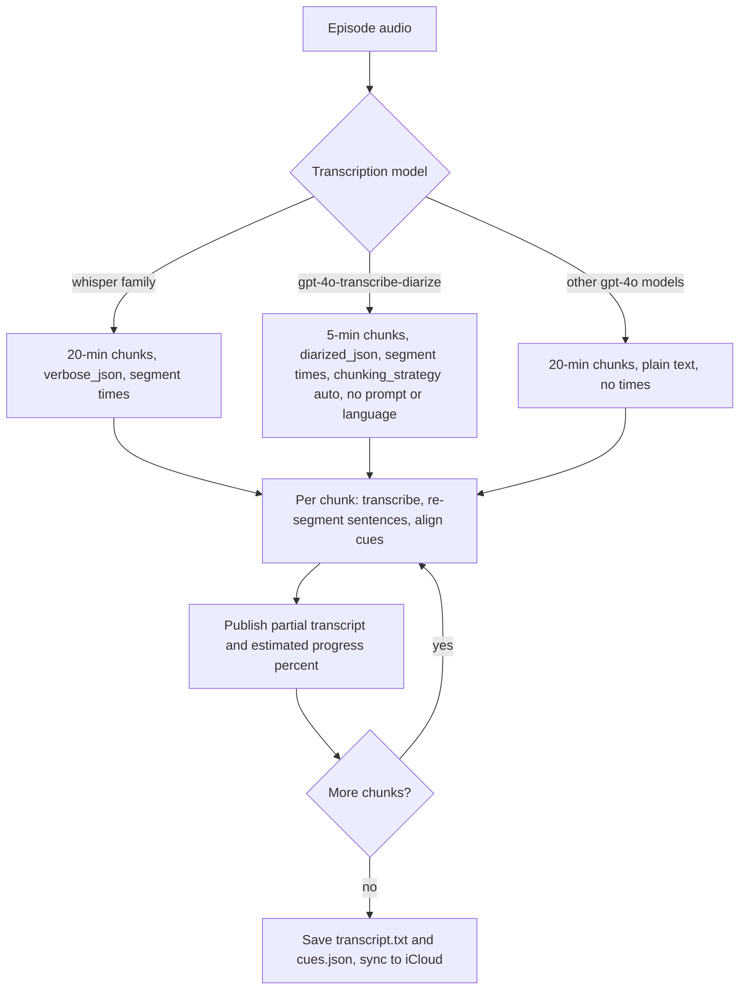

2026-08-01

# NerLan: gpt-4o-transcribe-diarize transcription with model-aware chunking and a progress estimate

## The problem

Transcripts of Vietnamese teaching episodes came out mangled. whisper-1 stores the Vietnamese script fine (diacritics intact), but the recognition itself is poor on code-switched audio: the Mandarin host and Vietnamese examples alternate faster than whisper's one-language-per-window decoding can follow, so it mis-hears words ("Cô có khỏe không" became "Có có khỏe không", 獨立宮 Dinh Độc Lập became 「孤獨獵人」) and falls into hallucinated repetition loops on the slow vocabulary-drill sections. Meanwhile the AI 講義 built *from that same bad transcript* looked fine — the handout step is generative, so gpt-5.4 silently reconstructs the canonical sentences from its own knowledge of Vietnamese. The transcript path, by contrast, is deliberately verbatim: the sentence-segmentation prompt forbids changing any character, so every ASR error survives to the screen.

The app already offered the gpt-4o-transcribe models, which handle code-switching far better — but they return no timestamps, so choosing them sacrificed the transcript's synced-sentence highlighting (`cues.json`).

## The fix: gpt-4o-transcribe-diarize

OpenAI's `gpt-4o-transcribe-diarize` is the one model in the 4o family that returns timed segments: `response_format=diarized_json` yields `{start, end, text, speaker}` per segment — the same start-plus-text shape the cue builder already consumes. So it combines 4o-level code-switching accuracy with working highlighting.

Per-model API differences, gated in `OpenAIService.transcribe`:

- diarize requires `chunking_strategy=auto` for audio over 30 s
- diarize rejects the `prompt` parameter (and `language` is undocumented for it), so the bilingual priming prompt whisper needs is omitted — the model detects each spoken language natively, which is exactly why it handles code-switched audio well
- diarized segments carry no leading spaces (whisper's do), so they join with a separator

A `TimestampStyle` enum (verboseJSON / diarizedJSON / none) replaced the old whisper-only `supportsSegments` boolean.

## Second problem: it timed out

The first on-device run failed after a long wait. The diarize model processes far slower than whisper — roughly half of real time — and the app was uploading 20-minute chunks. After the upload the server goes silent until processing completes; the app's URLSession gives up after 5 minutes without bytes, and a 20-minute chunk routinely needs longer than that. The model looked "broken" but the chunk size was simply tuned for fast models.

So chunking is now model-aware: diarize gets 5-minute chunks (each needing only ~1.5–2.5 minutes of server time, comfortably inside the timeout), everything else keeps 20-minute chunks. Since the transcript viewer already streams chunk-by-chunk, the smaller chunks also mean the first sentences appear after a couple of minutes instead of a ten-minute spinner. The trade-off — an episode becomes ~5 sequential requests, total wall time around 8–12 minutes — is accepted: the user keeps diarize for accuracy and separately configured Groq `whisper-large-v3` (fast, timestamped, OpenAI-compatible) via the app's existing custom-endpoint support as the quick alternative.

## Progress estimate

With multi-minute jobs the UI needed more than a spinner. `AIContentStore` now publishes `transcriptProgress` (0–1 per episode): audio-seconds of finished chunks plus a wall-clock estimate inside the current chunk. The expected per-chunk processing time is seeded per model (diarize ~0.5× audio duration, others ~0.2×) and recalibrated by blending in each finished chunk's measured rate, so the estimate improves as the episode progresses. It caps at 95% within a chunk and 99% overall — only real completion clears it. A once-a-second ticker task drives it, cancelled by `defer` so it can't outlive its chunk even on a thrown error.

Shown in two places: the full player's 逐字稿 button caption swaps to the live percentage while running, and the transcript viewer's streaming footer appends it (「轉錄中…（2/5） 37%」).

