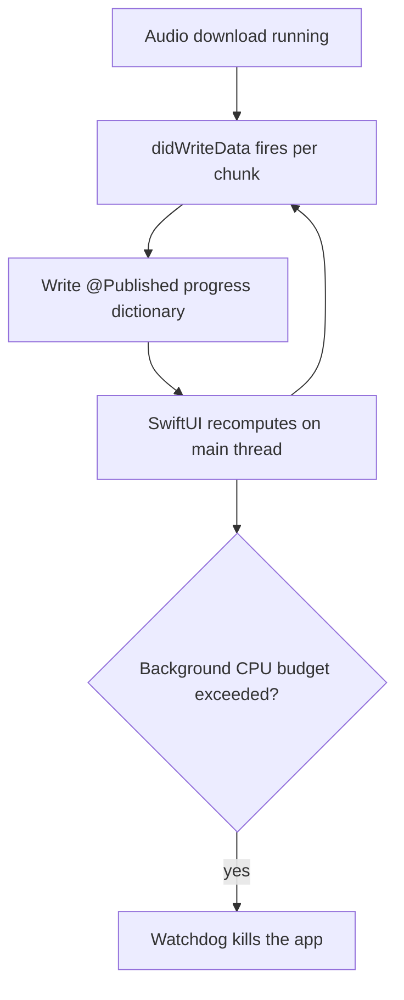

# NerLan — Download progress republishing got the app killed

## Problem

Downloading an episode's audio in the background could get the app terminated by
the system watchdog for exceeding the background CPU limit. The download itself
was fine; the act of *reporting* its progress was the problem.

## Root Cause

`DownloadManager` exposed `@Published progress: [String: Double]` and updated it
from `URLSession`'s `didWriteData` delegate callback — which fires on every
buffer chunk, constantly, for the whole download. Each update mutated an
`@Published` dictionary on the main thread, forcing SwiftUI to recompute the
observing views. Sustained over a long download in the background, that churn
alone pegged the main thread past the (tight) background CPU budget, and the
watchdog killed the app.

Worse, none of that work was needed: the UI never rendered the fraction — the
download indicator was always just an indeterminate spinner.

## Solution

Stop publishing per-byte progress entirely. Replace the fraction dictionary with
a membership set, `@Published downloading: Set<String>`, that records only
*which* episodes are in flight — written once when a download starts and once
when it completes. The `didWriteData` delegate method was removed outright, and
`PlayerView` now shows a plain indeterminate `ProgressView()` driven by
`isDownloading(episodeId:)`.

This drops the per-chunk main-thread work to zero while preserving the only thing
the UI actually showed.

## Key Files

- `NerLan/Sources/DownloadManager.swift` — `progress: [String: Double]` →
  `downloading: Set<String>`; removed the `didWriteData` delegate; insert on
  start, remove on completion.
- `NerLan/Sources/Views/PlayerView.swift` — determinate `ProgressView(value:)`
  → indeterminate `ProgressView()`.

## Lessons Learned

- An `@Published` property updated from a high-frequency callback is a hidden
  main-thread load — the cost scales with callback frequency, not with what the
  UI displays.
- Don't publish state the UI doesn't render. The indicator was always
  indeterminate, so per-byte progress was pure overhead.
- Background execution has a hard CPU budget; steady main-thread churn there is
  enough to trip the watchdog even when the actual work (the download) is idle-ish
  I/O.
