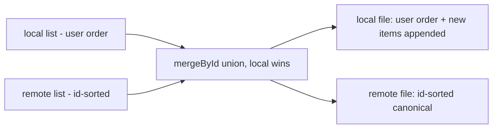

2026-07-07

# NerLan: Drive merge stops reshuffling the user's favorites order

## What was broken

`DriveSync.mergeById` unioned local and remote lists through a dictionary and returned `map.values.sorted { id($0) < id($1) }`. But `FavoritesStore` keeps `favorites.json` in the order the user favorited (plain `append`). So on the *first* Drive sync — even against an empty remote — the merged local bytes differed from the on-disk order, the file was rewritten id-sorted, `pulled > 0` triggered `reloadStores()`, and the Favorites tab visibly reordered into arbitrary UUID order. The podcast feed list suffered the same.

## Fix, and why the remote side stays sorted

Two orders now serve two different purposes:

- **Local file** — the user-visible order. The merge keeps `local`'s order and appends remote-only items at the end. A pull that brings nothing new leaves the local bytes byte-identical, so nothing is rewritten and nothing reorders.
- **Remote file** — a canonical, deterministic order (id-sorted, exactly what the mirror always contained). If the remote copy followed each device's local order instead, two devices with different orders would see `merged.remote != remoteBytes` on every sync and ping-pong uploads of the same content forever. Keeping the remote canonical means "same content ⇒ same bytes ⇒ no upload".

The Android app writes the same mirror; since its remote format was already id-sorted-compatible, no wire change is involved — only the local-side rewrite behavior changed.
