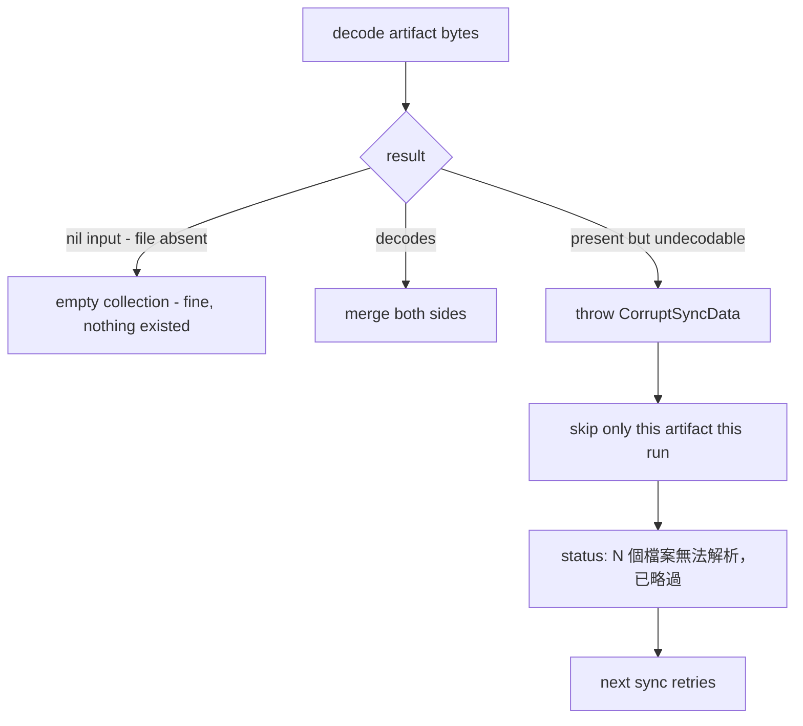

2026-07-07

# NerLan: Drive sync skips undecodable files instead of merging them as empty

## What was broken

Google Drive sync merges each JSON artifact (favorites, favorite programs, AI index, podcasts + subscription ledger) by decoding both sides, unioning, and writing back whichever side changed. Every decode helper had the shape:

```swift
return (try? JSONDecoder().decode([T].self, from: data)) ?? []
```

`JSONDecoder` fails the *entire array* when a single element is malformed — which happens with a truncated upload or a wire-format drift from the Android app (the two apps share this Drive folder). A corrupt remote `favorites.json` therefore decoded as `[]`, the merge produced local-only content, and — because the merged bytes differed from the remote bytes — that result was **uploaded**, silently deleting every remote-only favorite from the mirror. The mirror image of the bug overwrote a corrupt *local* file with remote-only content.

The root cause: "file is absent" and "file is present but unreadable" were collapsed into the same value (empty), and the merge engine can't tell a deliberate empty list from a failed read.

## Fix



- Decoders now take the artifact name and `throw CorruptSyncData(file:)` when bytes exist but don't decode; a `nil` input still returns empty.
- `performSync` wraps each metadata step in a small `run { }` helper that catches only `CorruptSyncData`, records the skipped name, and continues with the other artifacts. Network/auth errors still abort the whole run as before.
- The sync status line shows how many files were skipped, so silent corruption becomes visible instead of masquerading as a successful sync.

State tokens for a skipped file are not updated, so the file stays "changed" and is re-attempted on every subsequent sync until it decodes (e.g. the other device re-uploads it).
