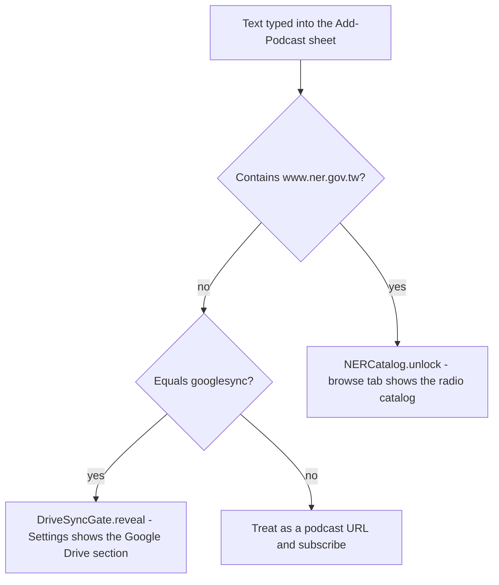

2026-08-30

# NerLan iOS: reveal the Google Drive sync section with a code, not a rebuild

## What it does

Typing `googlesync` into the Add-Podcast sheet's text field and tapping 新增
reveals the Google Drive section in Settings. The sheet just closes — the
Settings screen is watching the flag — and the section stays revealed on that
install from then on. A fresh install still shows nothing.

This is the same gesture the app already uses for the radio catalog: pasting any
`www.ner.gov.tw` URL into the same field reveals the 國立教育廣播電台 programs
(see [ship as a podcast player](nerlan-ship-as-podcast-player.md)).

## Why

The Drive section was hidden outright before the App Store submission: Google
sign-in is a third-party-login surface App Review scrutinises (guideline 4.8
wants Sign in with Apple offered alongside it), and the Android bridge wasn't
worth that argument. But "hidden" was a compile-time constant
(`showsGoogleDriveSync = false`), so the only way to use the feature on the
author's own phone was a rebuild with the constant flipped — and every such
build diverged from what shipped.

A runtime reveal code keeps the review story intact (a reviewer never sees the
section) while letting the feature be switched on per device with the same
gesture the catalog reveal already trained. Both codes live in the one text
field the app already exposes, so no hidden UI had to be invented.

## How

`DriveSyncGate` (in `DriveSync.swift`) mirrors `NERCatalog`: a UserDefaults key
(`googleDriveSyncRevealed`), an `isUnlockCode(_:)` check (exact, case-insensitive
match — not `contains`, so a real feed URL can't trip it), and `reveal()`.
`AddPodcastView.add()` checks it right after the NER URL check.
`SettingsView` reads the key through `@AppStorage`, replacing the hard-coded
constant, so the section appears without reopening Settings.

Only the UI is gated, exactly as before: the sync engine, the stored
`syncToDrive` toggle and any existing Google session are untouched, and the
launch-time `DriveSync.shared.syncNow()` still runs for installs that had the
toggle on.
