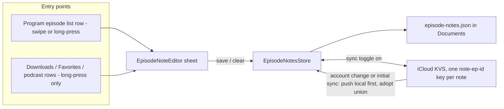

2026-07-31

# NerLan iOS: Per-episode user notes shown in episode lists

Channel+ course episodes are frequently titled nothing more than「EP12」— the
title carries no hint of what the lesson actually covers. This change adds a
note the user can write on any episode ("this one is the restaurant-ordering
dialogue"), displayed right in the episode lists so a lesson can be recognized
at a glance. Shipped as v1.9 build 11 to TestFlight.

## What it does

- **Adding a note**: in a program's episode list, swipe left on a row (orange
  註記 action) or long-press for a context menu. In the Downloads / Favorites /
  AI / podcast lists the same context-menu entry appears on long-press.
- **Editor**: a medium-detent sheet with a multi-line field, 儲存/取消, and a
  刪除註記 button when a note exists. Saving empty text also clears the note.
- **Display**: a saved note renders under the row's metadata line in orange
  with a `note.text` icon, up to two lines — in *every* list that shows the
  episode, since the Downloads and Favorites rows repeat the same
  uninformative titles.

## How it's built

A new `EpisodeNotesStore` singleton holds `[episodeId: text]`, persisted as
`episode-notes.json` in Documents — the app's deliberate no-database
convention. Because notes are hand-written content that would genuinely hurt
to lose, the store mirrors each note into iCloud KVS under its own
`note-ep-<id>` key, copying the proven `FavoritesStore` pattern verbatim:

- KVS is authoritative on remote change (a note cleared on one device
  disappears from the others);
- on an account change / initial-sync notification the store *reconciles* —
  re-pushes local notes KVS doesn't have, then adopts the union — so a
  system-emptied KVS can't wipe local notes;
- it hangs off the same 同步到 iCloud toggle as favorites and stats.

UX detail that shaped the wiring: `RecordRow` lists already use
swipe-to-delete (`onDelete`), and attaching `.swipeActions` to a row replaces
the system delete swipe — so those rows get the context-menu entry only, while
the program episode list (which has no swipe actions) gets both swipe and
long-press.

Notes are **not** in Google Drive sync yet: the Drive engine does per-file
merge logic and adding a new synced file is a real change, deferred until the
Android app grows the same feature (it doesn't have one today).
