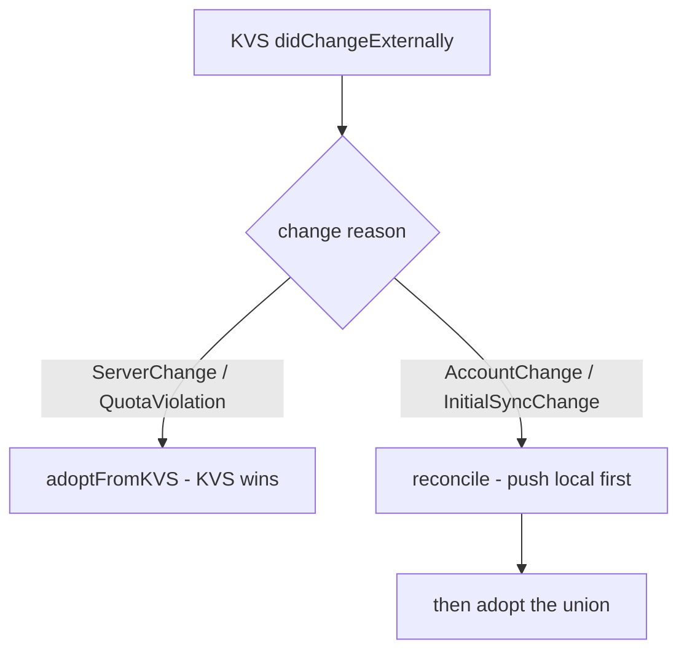

2026-07-07

# NerLan: don't wipe local favorites on iCloud account change

## What was broken

Favorites sync uses `NSUbiquitousKeyValueStore` (one key per favorite). `FavoritesStore.adoptFromKVS()` treated KVS as authoritative: on every `didChangeExternallyNotification` it replaced the in-memory favorites *and rewrote `favorites.json`* with whatever KVS currently held.

That is correct for the common case (an edit propagating from another device), but the notification also fires with reason `NSUbiquitousKeyValueStoreAccountChange` — the user signed out of iCloud or switched Apple IDs — and `NSUbiquitousKeyValueStoreInitialSyncChange` (first sync after a reinstall). In those cases the system *replaces the store's local cache*, often with an empty set. Blind adoption then erased every favorite on the device and overwrote the JSON files, so the loss was permanent.

## Root cause

The change handler ignored `NSUbiquitousKeyValueStoreChangeReasonKey`. All four reasons were funneled into the same "KVS wins" path, but only a plain server change actually means "KVS reflects the user's latest intent".

## Fix

`kvsChanged` now receives the `Notification` and branches on the reason:

`reconcile()` already existed for the enable-sync path (push any local entries KVS is missing, then adopt), so the destructive cases now reuse it — local favorites re-enter the (new) store before anything is adopted, and nothing is lost.

The other KVS-backed stores were audited for the same bug and are safe by construction: `PodcastStore.reconcile` is already push-first, `AIContentStore.adoptRecordsFromKVS` is additive-only, and `ListeningStatsStore` keeps its own device-local blob and only merges peers at read time.
