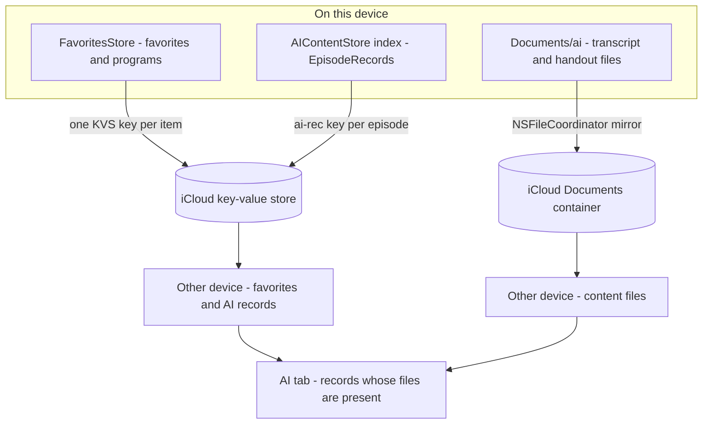

# NerLan — favorites iCloud sync & AI content tab

## Summary

Two related additions: favorited episodes and programs now sync across the user's
devices, and a new **AI** tab surfaces every episode that has a generated
transcript or AI handout, grouped by program or language. Both lean on iCloud so
they survive reinstalls and follow the user between devices.

## Approach

The session already mirrors the large, write-once transcript/handout **files**
through the iCloud Documents container (`ICloudSync`). Favorites and the AI tab's
per-episode metadata are a different shape — small, mutable, per-item — so they
ride a second, complementary lane: `NSUbiquitousKeyValueStore` (KVS), one key per
item, wrapped by a small shared `CloudKVStore`.

Key decisions:

- **KVS, one key per item.** A single whole-list blob would mean a favorite added
  on one device overwrites a favorite added on another. Per-item keys
  (`fav-ep-<id>`, `fav-prog-<id>`, `ai-rec-<id>`) let independent add/remove
  coexist. Gated by the same **同步到 iCloud** toggle as the file sync. Cost:
  KVS's ~1 MB / 1024-key ceiling, shared across favorites + AI records — ample
  for personal use, noted as a limit.
- **Favorites: KVS authoritative.** Favorites have no file backing, so on an
  external change the local set is rebuilt from KVS — which lets *unfavoriting*
  on one device propagate. Enabling sync first pushes any local-only favorites
  up (union), so nothing is lost when a device joins.
- **AI records: additive.** `AIContentStore`'s index changed from id→displayName
  strings to id→`EpisodeRecord`; that's what the AI tab renders, and it mirrors
  to KVS so the tab repopulates elsewhere. Adoption from KVS is additive (never
  removes a record that has local files), because the tab is ultimately gated on
  the content files actually being present — so a record without its file simply
  doesn't show until `ICloudSync` pulls the file down.
- **AI tab reuses `RecordRow`** in a new "ready-only" mode: it shows the
  transcript/handout buttons only for content that exists and ignores the API-key
  gate, so existing content is openable even on a device where the key isn't set.
- **Isolation:** `FavoritesStore` isn't `@MainActor`, so it can't read the
  actor-isolated toggle in its init; a `nonisolated static SettingsStore
  .syncToICloudEnabled` reads the persisted value directly.

Two refinements shipped alongside:

- The Downloads/AI program-language grouping picker moved out of the nav-bar
  toolbar (where it crowded the tab/nav chrome in the 390-pt iPad column) into a
  shared `GroupingPicker` at the top of the content.
- On iPad, starting an episode now defaults the right panel to that episode's
  study content, preferring a PDF handout, then the AI handout, then the
  transcript (`onChange(of: player.current)` in the split layout).

## Trade-offs

- **Migration gap.** The previous on-disk index stored only display-name strings,
  which can't decode as `EpisodeRecord`, so on first launch the AI tab is
  backfilled from downloads + favorites. AI content for an episode that was never
  downloaded or favorited (generated in a past run) won't appear until it's
  regenerated or that episode is downloaded/favorited. Everything generated from
  now on is captured.
- **KVS limits** (1 MB / 1024 keys) are a hard ceiling shared by favorites and AI
  records.
- **AI-record removal isn't authoritative** across devices (additive adoption);
  deleting AI content on one device doesn't remove the file from another, matching
  the existing file-sync limitation.
- The grouping picker now occupies a row of content height on iPhone too (it was
  a nav-bar item) — a deliberate uniformity choice.

## Key Files

- `NerLan/Sources/CloudKVStore.swift` — new; shared KVS wrapper (set/remove/
  entries-by-prefix/observe).
- `NerLan/Sources/FavoritesStore.swift` — KVS write-through, reconcile, authoritative adopt.
- `NerLan/Sources/AIContentStore.swift` — index now holds `EpisodeRecord`s,
  `aiRecords` for the tab, KVS record sync.
- `NerLan/Sources/Views/AITabView.swift` — new tab.
- `NerLan/Sources/Views/DownloadsView.swift` — shared `RecordGrouping` /
  `GroupingPicker`, `RecordRow` ready-only AI mode.
- `NerLan/Sources/Views/ContentView.swift` — AI tab in both tab layouts; iPad
  play-time panel default.
- `NerLan/Sources/SettingsStore.swift` — nonisolated toggle reader; enable/disable
  both sync lanes.
- `project.yml`, `NerLan/Resources/NerLan.entitlements` — ubiquity-kvstore entitlement.
