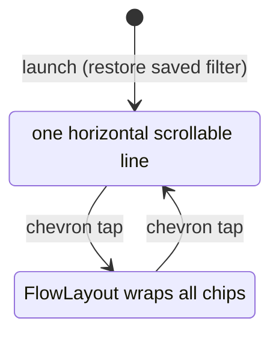

2026-07-12

# NerLan iOS: Foldable Language Chips with Persisted Filter

The program list's language filter chips took five wrapped rows before any
program was visible. The section now folds to a single line by default and
remembers the chosen filter across launches.

## What changed

- **Folded by default** — the chip section shows one line with a chevron at
  the trailing edge. Tapping the chevron expands the full wrap layout
  (`FlowLayout`); tapping again folds it back. Each launch starts folded.
- **Priority ordering** — chips lead with the most-studied languages
  (英語, 日語, 韓語, 法語), followed by the rest in catalog order, with 全部
  moved to the very end. This keeps the useful filters on the always-visible
  first line.
- **Persisted filter** — the selection is stored via
  `@AppStorage("programLanguageFilter")` (empty string = 全部), so the app
  reopens with the last filter active. If a stored language ever disappears
  from the catalog, the filter falls back to 全部 instead of rendering an
  empty list.

## The folding approach that failed

The first attempt taught `FlowLayout` a `maxRows` limit: rows beyond the cap
were "hidden" by placing their subviews at y = -100,000 (the SwiftUI `Layout`
protocol requires placing every subview, and parking extras far offscreen is
a common trick). Inside a `List`, this broke the entire screen: the list cell
grows to enclose out-of-bounds children, so the chips row inflated into a
blank card filling the whole viewport.

The fix avoids hidden subviews entirely by swapping the container per state:

- **Folded**: a horizontal `ScrollView` holding one `HStack` of all chips —
  overflow chips are reachable by swiping, nothing is hidden.
- **Expanded**: the original `FlowLayout`, unchanged.

One hardening change stayed in `FlowLayout`: it now answers the zero/infinity
width probes an enclosing `HStack` sends (a bare `List` row only ever proposes
finite widths) with its widest-row width instead of echoing a non-finite value
back.

Verified in the simulator (collapse default, expand, select 日語, relaunch →
filter restored and highlighted) and deployed to the phone for on-device
confirmation before committing.
