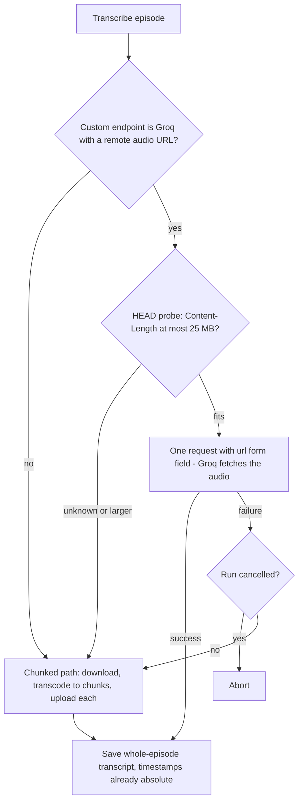

2026-08-06

# NerLan iOS: Groq URL-based transcription and learned progress rates

Commit `552367a` on `plateaukao/nerlan`.

## What it does and why

When the custom transcription endpoint points at Groq, the app now transcribes an episode by sending its **public audio URL** instead of the audio bytes. Groq extends the OpenAI-compatible `POST /audio/transcriptions` with a `url` form field ("either a file or a URL must be provided"), and fetches the audio server-side. That removes the entire client-side pipeline for that path — no download to a temp file, no AVFoundation transcode into ~20-minute chunks, no multi-megabyte uploads from the phone — and the whole episode comes back in a single request.

A second benefit falls out for free: the chunked path has to shift each chunk's segment timestamps onto the absolute episode timeline (with a heuristic for chunks that carry baked-in offsets). The URL path gets whole-episode timestamps that are already absolute, so transcript highlighting (cues) works with no shifting at all. Groq's `whisper-large-v3` / `-turbo` support `verbose_json`, which is what the existing `timestampStyle` logic already requests for any model named `whisper*`.

## Path selection

Groq caps URL-fetched files at 25 MB on the free tier (console.groq.com/docs/speech-to-text), so the URL path is gated on a `HEAD` probe of the audio URL: only a known `Content-Length` at or under the cap qualifies. Unknown sizes are treated as too big — a conservative choice that avoids paying for a request Groq will reject. Any Groq-side failure (URL unreachable from Groq, size lie, etc.) silently falls back to the proven chunked-upload path, so the feature can never make transcription *less* reliable than before; cancellation is checked in the fallback so a user-cancelled run aborts instead of restarting as an upload.

Groq detection is by host (`groq.com` / `*.groq.com`) on the custom base URL — the official-OpenAI provider and other custom servers are untouched. The URL path is preferred even when a local download exists: transcription needs the network anyway, and letting Groq fetch from NER beats transcoding and uploading from the phone.

## How it was built

- `OpenAIService` gained `Config.isGroq` and an `AudioSource` enum (`.file(URL)` uploads multipart bytes as before; `.remote(URL)` sends the `url` form field). `transcribe` takes the source; everything else about the request is shared.
- `AIContentStore.runTranscript` grew the size-gated Groq branch ahead of the download/chunk pipeline. The save/mirror tail (write transcript + cues sidecar, iCloud mirror, job cleanup, pending auto-open) was extracted into a shared `finishTranscript` helper used by both paths. The Groq path doesn't stream partials — there is only one "chunk" — so the auto-open-on-first-chunk signal is honored at save time instead.

## Learned per-model progress rates

The first on-device test showed the progress bar crawling to ~15% and then the finished transcript appearing: a single Groq request offers no server-side progress signal, and the hardcoded guess (processing takes ~5% of audio duration) was far slower than Groq's real speed.

Rather than tune the constant, each finished run now records its **measured** processing rate (seconds of processing per second of audio, spanning transcription + sentence cleanup — the same span the progress ticker covers) into UserDefaults, keyed by `server-host|model`, with URL and chunked modes kept as separate keys since their speeds differ by an order of magnitude. The next run seeds its estimate from that measurement, blended 50/50 with each new run so an outlier doesn't dominate. The hardcoded seeds (0.05 for Groq-by-URL, 0.2/0.5 for the chunked models) now only matter the first time a given server+model combination is used; from the second run on, the bar tracks reality.
