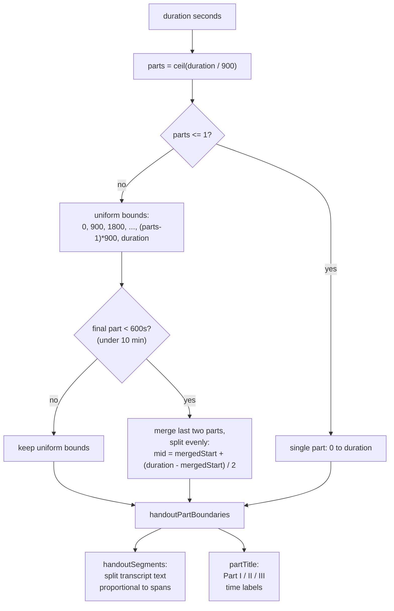

# NerLan — Redistribute a short handout tail across the last two parts

## Summary

NerLan generates AI "handouts" (study notes) from an episode's transcript. Long
episodes are split into ~15-minute "Parts" (Part I / II / III …) so each handout
section stays digestible. Previously the split was uniform 15-minute steps with
the **final** part taking whatever remained, which left a stub: a 35-minute
episode split into `0–15, 15–30, 30–35`, ending on a lonely 5-minute Part III.

Now, when the final part would run **shorter than 10 minutes**, the last two
parts merge and re-split evenly. A 35-minute episode becomes `0–15, 15–25,
25–35`. The 15-minute cap still governs every part before the tail.

| Duration | Before | After |
|---|---|---|
| 30 min | 0–15, 15–30 | 0–15, 15–30 *(exact 15-min tail, unchanged)* |
| 35 min | 0–15, 15–30, **30–35** | 0–15, **15–25, 25–35** |
| 40 min | 0–15, 15–30, 30–40 | 0–15, 15–30, 30–40 *(10-min tail is not a stub)* |
| 50 min | 0–15, 15–30, 30–45, **45–50** | 0–15, 15–30, **30–40, 40–50** |
| 16 min | 0–15, **15–16** | **0–8, 8–16** |

The 10-minute threshold is exclusive — a part of *exactly* 10 minutes (the 40-min
case) is left alone; only a strictly-shorter tail triggers redistribution.

## Approach

The change introduces a single source of truth, `handoutPartBoundaries(duration:)`,
returning the cut points `[0, b1, …, duration]`. It builds the uniform 15-minute
boundaries, then — if the last part is under 10 minutes — moves the second-to-last
boundary to the midpoint of the merged final span:

```
mid = mergedStart + (duration - mergedStart) / 2
```

Both consumers now derive from this one function:

- `handoutSegments` splits the transcript **text** at these boundaries.
- `partTitle` reads each part's **time-range label** from them.



A constraint surfaced while wiring this up: the old `handoutSegments` split the
transcript **evenly by character count** (each part ≈ `total / parts` chars),
while `partTitle` labelled the parts with **uneven** 15-minute ranges. So the
labels never actually described their content — a "Part III（30–35）" label sat
atop a chunk holding the last *third* of the transcript (~23–35 min of speech).
Folding both onto the shared boundaries fixed that latent mismatch: the text is
now split in **proportion to each part's labelled time span** (cumulative char
target `total × boundary / duration`), so under a roughly constant speaking rate
the content lines up with its label. The unknown-duration fallback (no timing
available) keeps the equal-character split.

The logic is mirrored verbatim in the Android app
(`plateaukao/nerlan-android`), which carries the same `AIContentStore` shape.

## Trade-offs

- **Single redistribution, not recursive.** Merging the last two parts can leave
  two ~8-minute parts (e.g. a 31-minute episode → `0–15, 15–23, 23–31`). That is
  intentional: the rule is "don't end on a stub," not "make every part ≥ 10 min."
  Re-balancing further would ripple boundaries backward for little gain.
- **Proportional text split assumes a roughly constant speaking rate.** Cut
  points are derived from audio time but applied to character offsets. A passage
  of dense silence or rapid speech can drift a boundary off its labelled minute.
  The alternative — aligning every cut to ASR segment timestamps — was rejected
  as overkill for a section header; sentence-boundary snapping already keeps cuts
  from landing mid-sentence.
- **Threshold is a fixed 10 minutes**, not a fraction of part length. Simple and
  predictable; chosen over a ratio rule because the part size (15 min) is itself
  fixed, so an absolute floor reads more clearly at the call site.

## Key Files

- `NerLan/Sources/AIContentStore.swift` (iOS) — new `handoutPartBoundaries(duration:)`
  plus the `handoutMinTailSeconds = 600` constant; `handoutSegments` and
  `partTitle` rewired to use it.
- `app/src/main/java/com/example/nerlan/data/AIContentStore.kt` (Android) — the
  same change mirrored in Kotlin (`HANDOUT_MIN_TAIL_SECONDS`, `handoutPartBoundaries`).
