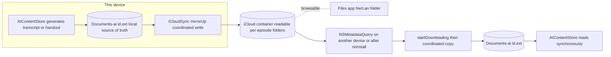

# NerLan — iCloud sync for AI transcripts & handouts

## Summary

AI-generated transcripts and handouts cost real OpenAI credits to produce and,
until now, lived only in the app's local `Documents/ai/` and vanished on
reinstall. This change mirrors that content into the app's iCloud container so it
survives reinstalls and propagates to the user's other devices. Audio is
deliberately *not* synced — it is large and free to re-download from Channel+.

The cloud copy is also exposed as a browsable **NerLan** folder in the Files app,
laid out one readable folder per episode rather than by opaque episode id.

## Approach

Local `Documents/ai/{transcripts,handouts}/{id}.{ext}` stays the **synchronous
source of truth** — `AIContentStore` keeps reading/writing there, and the app
works fully with iCloud off. A new `ICloudSync` type mirrors changes up and pulls
remote changes down, all coordinated with `NSFileCoordinator` on a background
queue (the first `url(forUbiquityContainerIdentifier:)` call blocks).

Design decisions worth noting:

- **iCloud Drive, not CloudKit.** The app's ethos is plain files, no DB. The
  ubiquity container preserves that exactly; CloudKit/`NSPersistentCloudKitContainer`
  would have imposed a schema layer. `NSUbiquitousKeyValueStore` was out too (1 MB
  cap; handouts exceed it).
- **Pull is read-only-ish.** Incoming files are copied down only when missing
  locally. Content is write-once (generated, then read-only unless explicitly
  regenerated), so "already present locally wins" avoids conflict handling.
- **Readable cloud layout.** Local files must stay keyed by `episodeId` (every
  lookup depends on it), so only the *cloud copy* is renamed: one folder per
  episode named `<program> - <title> [<id>]/` containing `transcript.txt` /
  `handout.html`. The `[id]` suffix is how the pull side maps a folder back to
  the local id-keyed file; inner names are fixed ASCII so `NSMetadataQuery`
  matching is immune to Unicode-normalization differences. The container is made
  public via `NSUbiquitousContainers` (with a bundle-version bump, which iCloud
  requires to re-read that metadata).
- **`ai/index.json` for names.** Because the in-memory `EpisodeRecord` is gone by
  the time content generated while sync was off gets pushed, a small id→name map
  is written at generation time and backfilled at launch from downloads/favorites,
  so bulk uploads still get readable folder names.

## Trade-offs

- **Regeneration doesn't overwrite an existing remote copy on other devices.**
  Pull-when-missing means a device that already has episode X keeps its copy even
  if X was regenerated elsewhere. Acceptable for a backup/restore feature; a
  content-modification-date comparison could add "newest wins" later.
- **Public container = user-deletable.** Exposing the folder in Files lets the
  user export content, but they can also delete/rename it there. Renaming a folder
  is fine as long as the `[id]` suffix survives; the local copy remains the source
  of truth regardless.
- **iOS-only.** Does not bridge to the Android app.
- **No persisted index for pre-feature content that was never downloaded or
  favorited** — such items fall back to a bare `[id]` folder name until
  regenerated.

## Key Files

- `NerLan/Sources/ICloudSync.swift` — new; container resolution, coordinated
  up/down mirroring, `NSMetadataQuery` watcher, readable-name layout, legacy
  cleanup.
- `NerLan/Sources/AIContentStore.swift` — calls `mirrorUp`/`removeUp` on
  write/delete/clear; owns `ai/index.json` (write at generation, backfill at
  launch); drives enable/disable.
- `NerLan/Sources/SettingsStore.swift`, `Views/SettingsView.swift` — the
  off-by-default "同步到 iCloud" toggle.
- `project.yml` — iCloud Documents entitlement + container, `NSUbiquitousContainers`
  (Files visibility), `CFBundleVersion` bump.
- `NerLan/Resources/NerLan.entitlements` — generated from `project.yml`.
