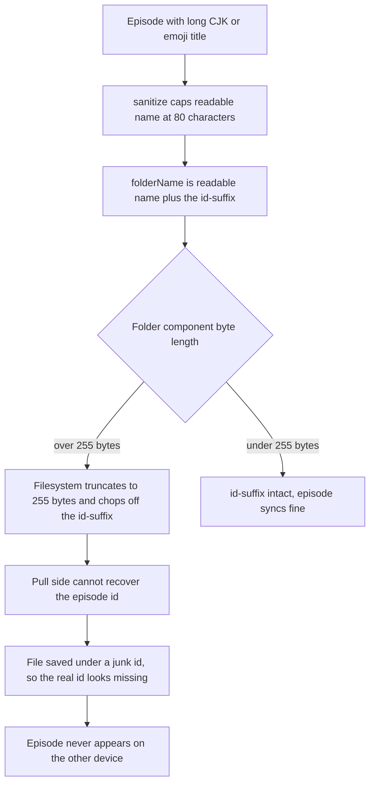

# NerLan — iCloud sync silently dropped long-titled episodes

## Problem

AI study content (transcripts, handouts, cues, translations) generated on the
iPhone failed to sync to the iPad for certain episodes — specifically the ones
with the longest titles, e.g. two *Didi 한국문화 Podcast* Korean episodes. Most
content synced fine; these few never appeared on the second device. Inspecting
the app's iCloud container also showed two kinds of garbage: folders whose name
was cut off mid-id with no closing `]`, and conflict duplicates inside episode
folders (`transcript 2.txt`, `handout 3.html`, …). Manually deleting the broken
folders didn't help — they "came back from nowhere."

## Root Cause

The cloud layout stores one folder per episode named `"<readable> [<id>]"`, where
the `[<id>]` suffix is the key the pull side uses (`extractId`) to map a folder
back to its episode. `sanitize` capped the readable part at **80 characters**,
but a filesystem path component maxes out at **255 bytes**. CJK is 3 bytes/char
and emoji 4, so a long Korean/emoji title pushed the whole component past 255
bytes and the OS truncated it — chopping off the closing `]` and part of the id.

Two follow-on effects compounded it:

- **Junk feedback loop.** When a device pulled a truncated folder, `extractId`
  returned the whole truncated folder name as the "id", so the file was saved
  locally under a bogus id (containing spaces/brackets). That junk file was then
  re-mirrored *up*, creating more malformed folders.
- **Conflict duplicates.** `mirrorUp` re-uploaded every artifact on every launch
  with `.forReplacing`. For write-once content across two devices this produced
  iCloud conflict copies (`transcript 2.txt`, etc.).
- **Manual deletion lost the race.** The truncated folders lived in the *local
  ubiquity copy* of both devices. Deleting them from one place (or from a Mac via
  the shell) just lost to another device re-uploading its copy — and hand-editing
  the iCloud container from Terminal is itself liable to corrupt iCloud Drive's
  bookkeeping ("Unable to complete iCloud Drive sync. Repair permissions").

## Solution

All fixes are in-app and **authoritative per device**, so the container converges
once every device runs the new build — no manual surgery:

1. **Byte-budget folder names.** `folderName` now reserves the full `" [<id>]"`
   suffix first and fits as much of the readable name as a UTF-8 byte budget (250)
   allows, truncating the *name* (not the id) on a character boundary. The id
   round-trips intact. Verified: the real Didi title + a 64-hex id yields a
   250-byte name that ends in `]` and round-trips to the exact id.
2. **Container self-heal on launch** (`cleanupContainerLocked`): remove folders
   that have `[` but no `]` (truncated orphans, id unrecoverable), and remove any
   file inside an episode folder that isn't one of the canonical `cloudFile`
   names (kills conflict duplicates).
3. **Pull-side guard** (`parseCloudURL`): skip truncated folders instead of
   saving them under a junk id.
4. **Local junk cleanup** (`AIContentStore.cleanupMalformedLocalContent`): delete
   any locally-stored content whose id isn't a UUID / `pod-<hex>` (ASCII
   alphanumerics + hyphen only), so the junk feedback loop can't re-mirror.
5. **Write-once upload** (`mirrorUp`): don't re-upload an artifact already present
   in the cloud (real file or `.<name>.icloud` placeholder); a changed artifact
   still routes through `removeUp` first, so re-translation etc. still upload.

The owning device re-creates a correctly-named folder for the affected episodes on
its next mirror-up, and the second device pulls it normally.

## Key Files

- `NerLan/Sources/ICloudSync.swift` — `folderName` byte budget + `byteLimited`;
  `cleanupContainerLocked` (wired into `start`); `mirrorUp` write-once skip +
  `cloudArtifactExists`; `parseCloudURL` truncated-folder guard. `sanitize` lost
  its character cap (length is now bounded by bytes around the id).
- `NerLan/Sources/AIContentStore.swift` — `cleanupMalformedLocalContent`, called
  from `init`.

## Lessons Learned

- **Filename limits are in bytes, not characters.** Any id/name packed into a
  path component must be budgeted in UTF-8 bytes; a character cap silently fails
  for CJK/emoji. Reserve the must-survive part (the id) first.
- **Make round-trip keys un-truncatable, or detect truncation.** A key embedded
  in a length-limited name needs both a budget that protects it and a parser that
  rejects a truncated form rather than guessing.
- **Never hand-edit an iCloud Drive container** (Finder is fine; `rm` in the
  ubiquity folder is not) — it can corrupt iCloud's state and trigger "repair
  permissions". Cleanup belongs in the app, which owns the container and can act
  authoritatively on every device.
- **Write-once content should upload once.** Re-replacing on every launch is what
  generated the conflict duplicates; skip when the cloud copy already exists.
