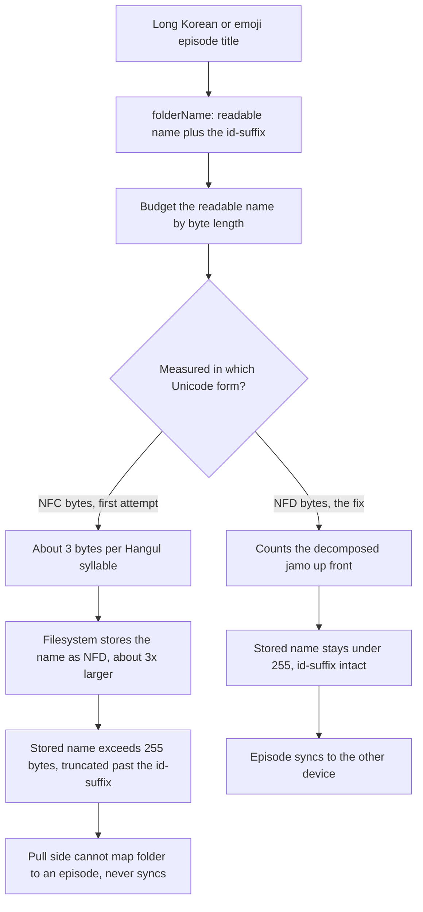

# NerLan — iCloud sync silently dropped long-titled episodes

## Problem

AI study content (transcripts, handouts, cues, translations) generated on the
iPhone failed to sync to the iPad for certain episodes — specifically the ones
with the longest titles, e.g. two *Didi 한국문화 Podcast* Korean episodes. Most
content synced fine; these few never appeared on the second device. Inspecting
the app's iCloud container also showed two kinds of garbage: folders whose name
was cut off mid-id with no closing `]`, and conflict duplicates inside episode
folders (`transcript 2.txt`, `handout 3.html`, …). Manually deleting the broken
folders didn't help — they "came back from nowhere."

## Root Cause

The cloud layout stores one folder per episode named `"<readable> [<id>]"`, where
the `[<id>]` suffix is the key the pull side uses to map a folder back to its
episode. The root cause was a length limit, but it took **two passes** to get
right because the limit applies to a different Unicode form than expected:

1. **Character cap, not byte cap.** `sanitize` capped the readable part at **80
   characters**, but a filesystem path component maxes out at **255 bytes**. CJK
   is 3 bytes/char and emoji 4, so a long Korean/emoji title pushed the component
   past 255 bytes and the OS chopped off the closing `]` and part of the id.
2. **NFC bytes, not NFD bytes.** Budgeting the readable name by its in-memory
   (NFC) UTF-8 length was *still wrong*: the filesystem/iCloud store names
   **decomposed (NFD)**, where each Hangul syllable expands from one codepoint
   (3 bytes) to 2–3 jamo (~3× the bytes). So a name that measured ≤250 NFC bytes
   ballooned past 255 once stored and was truncated again — sometimes past the `[`
   itself, leaving a folder that ended mid-jamo with no bracket at all. The fix is
   to budget by **NFD** byte length.

Two follow-on effects compounded it:

- **Junk feedback loop.** When a device pulled a truncated folder, the old parser
  returned the whole truncated folder name as the "id", so the file was saved
  locally under a bogus id (containing spaces/Korean/brackets). That junk file was
  then re-mirrored *up*, creating more malformed folders.
- **Conflict duplicates.** `mirrorUp` re-uploaded every artifact on every launch
  with `.forReplacing`. For write-once content across two devices this produced
  iCloud conflict copies (`transcript 2.txt`, etc.).
- **Manual deletion lost the race.** The truncated folders lived in the *local
  ubiquity copy* of both devices. Deleting them from one place (or from a Mac via
  the shell) just lost to another device re-uploading its copy — and hand-editing
  the iCloud container from Terminal is itself liable to corrupt iCloud Drive's
  bookkeeping ("Unable to complete iCloud Drive sync. Repair permissions").

## Solution

All fixes are in-app and **authoritative per device**, so the container converges
once every device runs the new build — no manual surgery:

1. **NFD-byte-budget folder names.** `folderName` reserves the full `" [<id>]"`
   suffix first, then fits as much of the readable name as a byte budget (250)
   allows — measured on the **decomposed (NFD)** form (`byteLimited` uses
   `decomposedStringWithCanonicalMapping`), truncating the *name* (not the id) on a
   character boundary. Verified: the offending Didi title yields a name that is
   246 NFD bytes, ends in `]`, and round-trips to the exact id.
2. **A strict parser that returns nil for unmappable names** (`parsedId`): a folder
   maps to an id only if it ends in `]` (readable+id) or is a bare ASCII
   alphanumeric/hyphen id (UUID / `pod-<hex>`). A truncated name — whether it kept
   a stray `[` or was chopped before it — satisfies neither and is treated as
   garbage rather than guessed at.
3. **Container self-heal on launch** (`cleanupContainerLocked`): remove folders
   where `parsedId` is nil (truncated, any form), and remove any file inside an
   episode folder that isn't a canonical `cloudFile` name (kills conflict
   duplicates).
4. **Pull-side guard** (`parseCloudURL`): skip folders `parsedId` can't map,
   instead of saving them under a junk id.
5. **Local junk cleanup** (`AIContentStore.cleanupMalformedLocalContent`): delete
   any locally-stored content whose id isn't ASCII alphanumerics + hyphen, so the
   junk feedback loop can't re-mirror.
6. **Write-once upload** (`mirrorUp`): don't re-upload an artifact already present
   in the cloud (real file or `.<name>.icloud` placeholder); a changed artifact
   still routes through `removeUp` first, so re-translation etc. still upload.

The owning device re-creates a correctly-named folder for the affected episodes on
its next mirror-up, and the second device pulls it normally.

## Key Files

- `NerLan/Sources/ICloudSync.swift` — `folderName` budget + `byteLimited` (NFD);
  `parsedId` (replacing the old guess-the-id `extractId`), used by
  `parseCloudURL`, `cleanupContainerLocked`, and `episodeFolderLocked`;
  `cleanupContainerLocked` (wired into `start`); `mirrorUp` write-once skip +
  `cloudArtifactExists`. `sanitize` lost its character cap (length is now bounded
  by NFD bytes around the id).
- `NerLan/Sources/AIContentStore.swift` — `cleanupMalformedLocalContent`, called
  from `init`.

## Lessons Learned

- **Filename limits are in bytes, not characters — and in the *decomposed* (NFD)
  form.** Any id/name packed into a path component must be budgeted in UTF-8 bytes
  of `decomposedStringWithCanonicalMapping`, not the in-memory NFC string. A
  character cap fails for CJK/emoji; an NFC-byte cap *still* fails for Hangul,
  which expands ~3× when the filesystem stores it decomposed. (First fix used NFC
  bytes and only made it worse — letting more text through, which expanded past the
  bracket.) Reserve the must-survive part (the id) first.
- **Make round-trip keys un-truncatable, or detect truncation.** A key embedded
  in a length-limited name needs both a budget that protects it and a parser that
  rejects a truncated form rather than guessing.
- **Never hand-edit an iCloud Drive container** (Finder is fine; `rm` in the
  ubiquity folder is not) — it can corrupt iCloud's state and trigger "repair
  permissions". Cleanup belongs in the app, which owns the container and can act
  authoritatively on every device.
- **Write-once content should upload once.** Re-replacing on every launch is what
  generated the conflict duplicates; skip when the cloud copy already exists.
