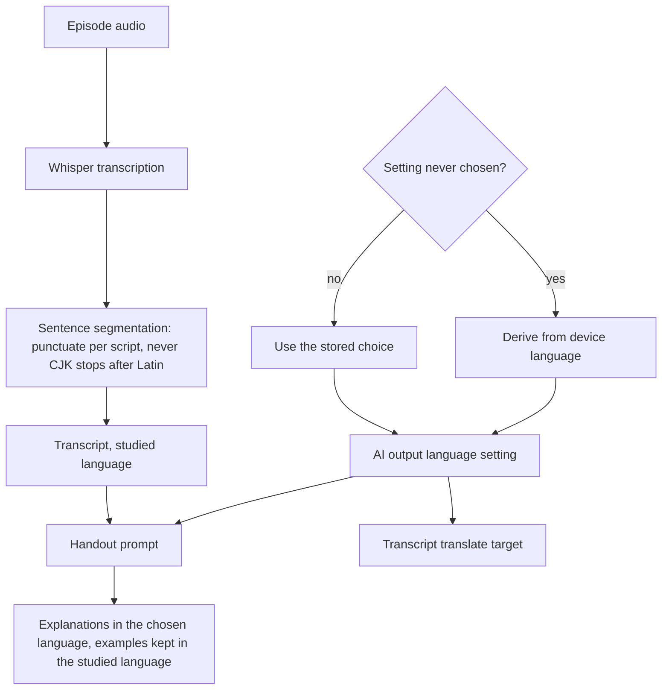

2026-08-16

# NerLan iOS: making the AI write in the reader's language, not always Chinese

## What it does and why

The app had just been localized into English, and the seam showed the moment you
used it: English UI, English transcript of an English episode — and then a study
handout in Traditional Chinese. The handout prompt was written in Chinese, and
its four section headings (內容說明 / 文法重點 / 例句 / 單字) were part of the
prompt's own wording, so Chinese output wasn't a setting, it was structural.

That was right for the audience the app started with and wrong for anyone else.
The handout is the feature the App Store description spends the most words on;
an English-speaking reviewer opening it and finding Chinese undercuts everything
the listing claims.

So the output language became a parameter, driven by a setting.

## One setting, not two

There was already a `translationLanguage` setting — the target for the
transcript screen's translate button. Adding a second, near-identical
"handout language" picker beside it would have been worse than the problem. Both
are the same question — *what language do I want the AI to write in?* — so one
setting now drives both, relabelled from 翻譯 to **AI 輸出語言 / AI Output
Language**. The stored UserDefaults key is unchanged, so nobody's existing choice
moved.

Its default changed too. It was hardcoded `繁體中文`, which meant an English
speaker got Chinese handouts until they found the setting. It now derives from
the device language, so the English simulator came up reading "English" with no
intervention. Only new installs are affected — an existing choice is persisted
and wins.

The invariant the prompt has to hold onto: only the *explanations* follow the
setting. Example sentences and vocabulary stay in the language being studied —
that's the entire point of a handout. Studying French from an English handout
means French sentences with English glosses, not French translated away.

## Three rounds of prompt bugs, each found by looking at output

This is the part worth recording, because none of it was visible in the code.

**Round 1 — CJK punctuation in French.** The first English handout quoted
`Nous sommes le jeudi 13 août 2026。` — a Chinese full stop after a French
sentence. The handout model wasn't inventing it; it was faithfully quoting the
transcript, which had `Bonjour à tous nos auditeurs。` in it. The culprit was the
*sentence-segmentation* prompt, one step upstream. It did say to use half-width
punctuation for foreign text, but that clause sat inside an otherwise-Chinese
prompt and lost. Fixed by forbidding `。` and `、` after Latin/Hangul/Cyrillic
sentences outright. This affected every non-CJK transcript the app had ever
produced, not just this screenshot.

**Round 2 — the prompt's own English leaking into Chinese.** Rewriting the
handout prompt in English made the English path work, so it got committed as
verified. It wasn't: regenerating with the target set back to 繁體中文 produced a
correctly Chinese body under headings that were still "Overview / Grammar
points", plus a fragment of the prompt's wording surfacing mid-sentence —
`由certain phrases and expressions引導的情境下`. Both came from spelling the
sections out as literal markup (`<h2>Overview</h2>`), which reads as text to copy
rather than a description to translate. They became a numbered list of what each
section is *for*, with an explicit rule that nothing from the instructions may
appear verbatim.

**Round 3 — the wrong Chinese.** The first clean Chinese regeneration chose
語法點, a mainland term, where the app has always said 文法. Naming 文法/語法 and
影片/視頻 as examples was enough; headings now come back as 概述 / 文法要點 /
例句 / 詞彙表.

The lesson, stated plainly because the second round was a self-inflicted
regression: **an English-authored prompt can be right for the language it is
written in and wrong for every other.** Verifying the language you just fixed is
not verification. Every prompt change now needs a regeneration in both English
and Chinese before it counts.

## Verified

On a News in Slow French episode (chosen because 8–9 minutes keeps regeneration
cheap — this took five generations to get right):

- **English output:** headings `Overview / Grammar points / Example sentences /
  Vocabulary`; French examples preserved verbatim, each glossed in English;
  grammar points naming the subjunctive and conditional. Zero CJK characters in
  either transcript or handout.
- **Chinese output:** headings `概述 / 文法要點 / 例句 / 詞彙表`; body in
  Traditional Chinese with Taiwanese terminology; French examples intact.

## Still open

Much of these prompts is defensive scaffolding for `gpt-4o`'s instruction
following — the negative rules, the "nothing may appear verbatim" clause. Moving
the default to a newer model should let most of it be deleted, and that's the
next thing to try. Any new model id has to be checked against `GET /v1/models`
first: `defaultChatModel` is what every new install gets, so an id that doesn't
resolve breaks all AI features with a 404 that reads like a broken app. Latency
matters as much as quality here — handouts run a chat call per ~15-minute
segment and segmentation one per 4000 characters, so a reasoning-tier default
would make a 50-minute episode painful.
