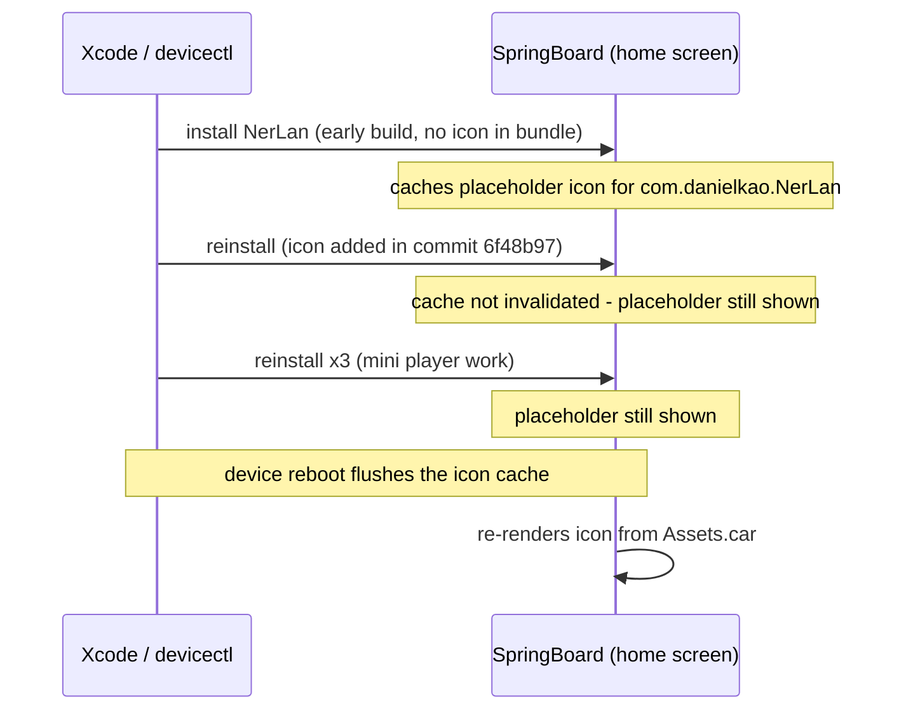

# NerLan (iOS): app icon missing on home screen — SpringBoard icon cache

## Problem

The NerLan iOS app showed a blank/generic placeholder icon on the iPhone home screen, even though an app icon (orange gradient, headphones, A文 badge — matching the Android app) had been added to the repo in commit `6f48b97` and the app had been reinstalled several times since.

## Root Cause

Nothing was wrong with the build. Verification of all three layers of the installed bundle confirmed the icon was present and correctly wired:

- `Assets.car` contained the compiled `AppIcon` renditions (modern single-size 1024×1024 "Icon Image" + "MultiSized Image" entries, which iOS 13+ scales at runtime) — checked with `xcrun assetutil --info`.
- The bundle contained `AppIcon60x60@2x.png` / `AppIcon76x76@2x~ipad.png`.
- `Info.plist` had a correct `CFBundleIcons` → `CFBundlePrimaryIcon` → `CFBundleIconName: AppIcon` entry — checked with `PlistBuddy`.

The real cause: **SpringBoard caches an app's icon per bundle ID, and developer reinstalls (Xcode / `devicectl device install app`) often do not invalidate that cache.** NerLan was first installed on the device *before* the icon existed, so SpringBoard cached the blank placeholder for `com.danielkao.NerLan` and kept serving it through every subsequent reinstall. This is a long-standing iOS behavior (iOS 15+), documented in Apple Developer Forums threads ([690414](https://developer.apple.com/forums/thread/690414), [682648](https://developer.apple.com/forums/thread/682648)).

## Solution

**Restart the iPhone.** A reboot flushes SpringBoard's icon cache and the icon renders from the installed bundle's `Assets.car`. No code or build changes were needed.

The alternative — uninstalling and reinstalling the app — also flushes the cache but was rejected because it deletes the app's Documents directory, which holds the user's downloaded episodes (`audio/*.mp3`, `downloads.json`) and favorites (`favorites.json`, `favorite-programs.json`).

## Key Files

- `NerLan/Resources/Assets.xcassets/AppIcon.appiconset/` — single-size 1024 `icon-1024.png` + `Contents.json` (universal/ios idiom)
- `project.yml` — `ASSETCATALOG_COMPILER_APPICON_NAME: AppIcon` and the `Assets.xcassets` resources entry

## Lessons Learned

- When an icon (or any resource) "doesn't show", verify the installed artifact before suspecting the build: `ls` the `.app` bundle, `PlistBuddy -c "Print :CFBundleIcons"` on its `Info.plist`, and `xcrun assetutil --info Assets.car`. If all three check out, the problem is on the device side.
- SpringBoard's icon cache is keyed by bundle ID and survives dev reinstalls. If an app is ever installed icon-less, the placeholder sticks until a reboot. Adding the icon *before* the first device install avoids this entirely.
- Uninstall-to-fix is destructive for this app: all user data is plain files in Documents. Prefer the reboot.
- Minor: `icon-1024.png` has an alpha channel. Fine for home screen display (the artwork is fully opaque) and for a sideloaded personal app, but App Store review rejects alpha in the 1024 marketing icon — flatten it if the app is ever submitted.
