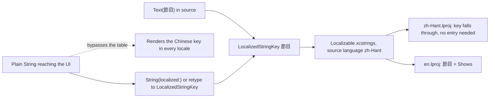

2026-08-16

# NerLan iOS: English localization ahead of the App Store submission

## Why, and what was actually there

The app was to be submitted to the App Store, and the question "does it support
English?" had a blunt answer: not at all. There was no localization
infrastructure of any kind — no `.strings`, no `.xcstrings`, no `.lproj`, no
`NSLocalizedString`/`String(localized:)` call anywhere, and no
`developmentRegion`/`knownRegions` in `project.yml`. Every user-facing string
was a hardcoded Traditional Chinese literal, so the app rendered Chinese no
matter what language the device was set to.

One piece of luck made this much cheaper than it looked: SwiftUI's `Text("節目")`
already produces a `LocalizedStringKey`. The call sites were *already*
localizable — they just had no table to look anything up in.

## The approach: Chinese keys, English as the translation

zh-Hant became the development language and the Chinese strings stayed as the
catalog keys, with English layered over them as a translation. The alternative —
rewriting every literal into an English or semantic key — would have touched
hundreds of call sites for no benefit.

Because the keys don't change, the vast majority of the app needed no source
edits at all. Two String Catalogs were added, one per bundle: the widget
extension ships separately and can't read the app's table, so it carries its own
copy of every string it draws, including the ones from the shared intent code
in `NerLan/Shared`.

## The part that did need code changes

The dangerous sites were the ones where a plain `String` reached the UI.
`Text(someString)` takes the `String` overload, which does **no** table lookup —
those would have silently rendered the Chinese key in English. The
proof-of-concept build caught the first one immediately: the browse tab's title
was a computed `String`, so it stayed 節目 while everything around it turned
English.

They fall into two shapes:

- **Values computed or stored as `String`** — AI job progress ("轉錄中…"), Drive
  sync status, `LocalizedError.errorDescription` implementations, duration
  formatting, grouping fallbacks. These became `String(localized:)`.
- **View parameters typed `String` that only ever receive literals** —
  `TopTitle`/`ScrollAwayTitle`, `WidgetEmptyState.message`,
  `SettingsView.verifyRow(title:)`, the Mac sidebar's tab titles. These changed
  type to `LocalizedStringKey`, which is both correct and self-documenting.

A third shape needed splitting rather than converting: enums like
`RecordGrouping` and `DownloadFilter` use their raw values as *both* the
persisted `@AppStorage` representation and the display text. Translating the raw
value would have silently invalidated everyone's saved preference, so the raw
values stay Chinese and each enum gained a separate `label:
LocalizedStringKey` that the views draw instead.

## Getting the keys right

Interpolated strings don't key on their source text — `Text("共 \(count) 集")`
keys on `共 %lld 集`, and guessing the specifier for every such site is a good way
to ship strings that silently never match. So the key list wasn't hand-written:
the project was built once with `SWIFT_EMIT_LOC_STRINGS=YES`, and the resulting
`.stringsdata` files were read back to get the compiler's own extraction — 228
keys for the app, 49 for the widget, specifiers exactly as emitted. The catalogs
were then generated from that list, with a check that every key had a
translation and no invented keys crept in.

That pass also settled a question about Siri: the `AppShortcuts` table came back
with only five entries and two of them were already English, because the phrase
arrays in `SiriIntents.swift` had been authored bilingually from the start. App
Shortcuts needed no work.

## Deliberately left in Chinese

Not every Chinese literal in the codebase is UI, and translating the rest would
have broken things:

- **OpenAI prompt text** — the transcription and handout prompts describe a
  Mandarin-language teaching broadcast to the model. They're prompt engineering,
  not copy; translating them changes what the AI does.
- **The podcast-feed language table** — matched against feed metadata to guess a
  show's language. It's data, not display.
- **Siri's Chinese recognition aliases** in `SiriNaming` — the spellings Siri
  matches spoken input against.
- **The translation-language menu** — its entries (繁體中文, English, 日本語,
  한국어, …) are endonyms on purpose, written the way a native reader expects,
  and are passed into the translation prompt verbatim.

The Info.plist purpose strings (microphone, local network) got their own
`InfoPlist.xcstrings`, since a permission prompt in the wrong language is
exactly the kind of thing App Review notices.

## Verification

Built clean, then installed to iPhone 16 / iOS 26.4 and launched twice with
`simctl launch -AppleLanguages`: once as `(en)`, once as `(zh-Hant)`. English
renders throughout the browse tab and the full Settings screen — including the
long explanatory footers — while the translation-language picker correctly still
reads 繁體中文. Chinese is unchanged from before the change.

## Two gaps the screenshots found that reading the code did not

Capturing App Store screenshots of the English build turned up two leaks. Both
are worth recording because neither shows up as a build warning, a missing key,
or anything else a compiler will tell you about — the app just quietly draws
Chinese.

**Language labels were translated in the wrong place.** The player badge, the
download group headers, and the stats rows drew a raw 語言 label: `英語` sitting
in an otherwise-English screen. The obvious fix — translate
`PodcastFeedParser.mappedLanguage` at the source — is wrong twice over. That
same string primes the transcription prompt (`OpenAIService.transcriptionPrompt`
is written around the Chinese term), and it is the grouping key persisted in
`downloads.json` and `favorites.json`, so changing it would alter what the model
is told *and* silently re-key every saved record. The label therefore stays
Chinese in storage and is translated only where it is drawn, through
`localizedLanguageName`, which passes anything outside a known set straight
through — catalog language names come from the API and can't be mapped.

**Runtime-built keys are invisible to the extractor.** `RecordGrouping`,
`DownloadFilter` and `ChartRange` draw their labels with
`LocalizedStringKey(rawValue)` — a key assembled at runtime from a stored
string. `SWIFT_EMIT_LOC_STRINGS` only sees literals, so `語言`, `快取`, `日`,
`週` and `月` were never extracted, were absent from the catalog, and fell
through to the key. The grouping toggle read **"Shows | 語言"**. They're now in
the catalog explicitly, with a comment saying why they can't be extracted.

The general lesson: deriving the key list from the compiler is the right way to
get *specifiers* right, but it is not a completeness check. Anything that
reaches the UI without passing through a string literal — a runtime-built key, a
stored value, a `String` that only later lands in a `Text` — is invisible to it,
and the only reliable way to find those is to run the app in the target locale
and look. A sweep of every tab, the show detail, the player and all three pages
of Settings is what confirmed the rest was clean.
