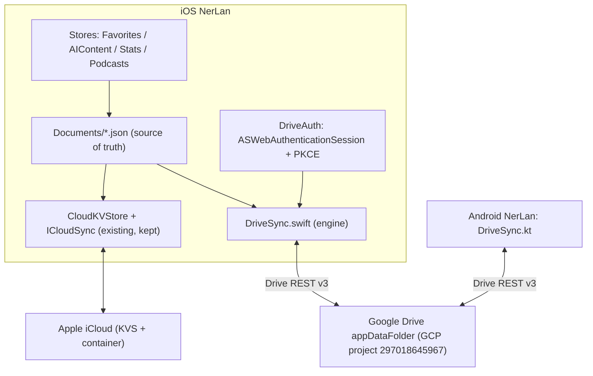
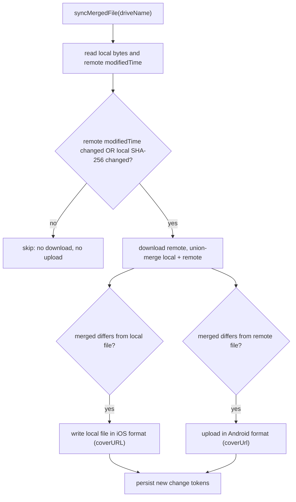

# NerLan iOS — Google Drive sync (implementation)

> Status: **Shipped** (PR #1, merged to `main`). Verified on device: sign-in flow,
> Android interop, and iCloud↔Drive coexistence. This is the build-out of the
> earlier proposal (`nerlan-ios-google-drive-sync.md`), which it confirms end-to-end.

## Summary

iOS now syncs to Google Drive's hidden, app-private **`appDataFolder`** as an
opt-in *second* backend, sitting beside the existing iCloud sync rather than
replacing it. The payoff is interop: the Android app already syncs into that same
folder, so iOS and Android become peers in one folder — no server, no bridge. The
load-bearing enabler is that the `appDataFolder` is shared by **all OAuth clients
in one GCP project, per user**: iOS authenticates with the OAuth client from the
*same* project (297018645967) the Android app uses, so it reads/writes the exact
hidden folder Android already populates.

Synced: favorites, favorited programs, the AI record index, transcripts / handouts
/ cue + translation sidecars, listening stats, and podcast subscriptions. Audio is
deliberately never synced (large, and re-downloadable for free from Channel+).

## Approach

**Auth — mirror Android's browser half, natively.** iOS has no Google Play
Services, so the dual-path complexity Android needs (GMS broker vs. browser
fallback) collapses to just the browser path. `DriveAuth` uses Apple's
`ASWebAuthenticationSession` + PKCE — no Google SDK, honoring the app's
no-dependencies rule. It **reuses the Android browser client as-is**: that client
turned out to be an iOS-type OAuth client (its redirect is the reverse-client-ID
scheme `com.googleusercontent.apps.297018645967-…`, no client secret), which is
exactly what a native PKCE public client wants. The refresh token lives in the
Keychain; the access token is cached in memory and refreshed silently. A revoked /
expired refresh token (`invalid_grant`) surfaces as a re-login prompt.

**Transport — Drive REST v3 over `URLSession`.** A direct port of Android's OkHttp
calls: `listFiles` (`spaces=appDataFolder`), multipart create, and
`PATCH uploadType=media` update. Scope is `drive.appdata` only.

**Engine — ported 1:1 from `DriveSync.kt`.** The conflict resolution is
deliberately platform-agnostic and ported verbatim:
- Change detection via a local `drive-sync-state.json` holding, per file, the
  remote Drive `modifiedTime` and the SHA-256 of the bytes this device last wrote.
  When both still match, the file is skipped — no download, no upload.
- Union-merge by id (last write wins) for metadata lists; local-overrides-remote
  for the AI index map; write-once copy for content files.
- A **G-counter** for stats (one blob per device, summed on read).
- A last-writer-wins **ledger** (`podcast-subs.json`) for podcast subscriptions,
  so an unsubscribe — and a later re-subscribe — propagate, which a plain
  union-merge of the feed list cannot express.

**Wire compatibility.** The data models are near-identical across platforms, so the
only translation needed is a single field-name divergence: iOS `EpisodeRecord` /
`PodcastFeed` serialize `coverURL` (no `CodingKeys`), Android emits `coverUrl`. A
pair of `Wire*` DTOs carry Android's casing on the wire while the local files stay
in iOS-native format; the merge therefore decodes local (iOS) and remote (Android)
into a common in-memory model, then writes the local file in iOS format and uploads
in Android format. Everything else — `Program`, `Attachment`, `Stats`, the sub
ledger, the `stats-{deviceId}.json` / `transcript-{id}.txt` / `ai-index.json` file
names — already matches field-for-field.

**Coexistence with iCloud (the one real design decision).** Drive is added as an
independent mirror, not a replacement: both backends write from the same
`Documents/*.json` source-of-truth, gated by separate Settings toggles, and are
kept in step when both are on (an iCloud-driven file change requests a Drive sync,
and a Drive pull pushes new items into KVS). When the Drive toggle is off, every
Drive call is a no-op, so the iCloud behavior is byte-for-byte unchanged. The store
hooks are purely additive: `reload*()` methods invoked only after a Drive pull, and
`DriveSync.requestSync()` fired (debounced) on local change.

One subtlety the G-counter forced: iCloud keeps its peer stat blobs in KVS, which
Drive can't see, so Drive mirrors peers into a `stats-peers/` directory instead.
The merged read keys peers by device id across **both** sources, so a device
syncing through both backends is counted once — the partitions must stay disjoint
or the counter double-counts.

## Trade-offs

- **Additions propagate, deletions don't** (except podcast subs, which carry the
  LWW ledger). This is the same backup-favoring tradeoff the iCloud file sync makes;
  a deleted favorite re-appears if any peer still has it. Acceptable for a personal
  backup/bridge, and consistent with Android.
- **No server-side change feed**, so sync runs on launch, on sign-in, and ~2.5s
  after a local change (debounced) — not push-driven. Fine for single-user,
  low-frequency edits.
- **Metadata files sync sequentially** (they're tiny single files); only the
  potentially-many content files parallelize, with bounded concurrency. Simpler to
  reason about than Android's fully-concurrent pass, at negligible latency cost.
- **The merge re-sorts lists by id**, so a favorite added locally can reorder after
  a sync rewrites the file. Cosmetic, and matches Android.
- **Consent-screen gotcha (operational, not code):** if the Google OAuth consent
  screen is left in "Testing", Google revokes the refresh token after a few days
  and the user must re-sign-in. Publishing the app (or adding the user as a test
  user) in the Cloud console fixes it.

## Key Files

- `NerLan/Sources/DriveAuth.swift` — browser OAuth (`ASWebAuthenticationSession` +
  PKCE), token cache, Keychain refresh token, id_token → email.
- `NerLan/Sources/DriveSync.swift` — the engine: change-tokened sync, per-type
  merges, Drive REST v3, and the `Wire*` DTOs.
- `NerLan/Sources/SettingsStore.swift` — the `syncToDrive` toggle.
- `NerLan/Sources/Views/SettingsView.swift` — sign in/out, account, manual sync,
  status.
- `NerLan/Sources/FavoritesStore.swift`, `AIContentStore.swift`,
  `ListeningStatsStore.swift`, `PodcastStore.swift` — additive `reload*()` hooks,
  `requestSync()` triggers, the stats `stats-peers/` merge, and the new podcast
  subscription ledger.
- `NerLan/Sources/NerLanApp.swift`, `Views/ContentView.swift` — inject `DriveSync`
  and pull on launch.
